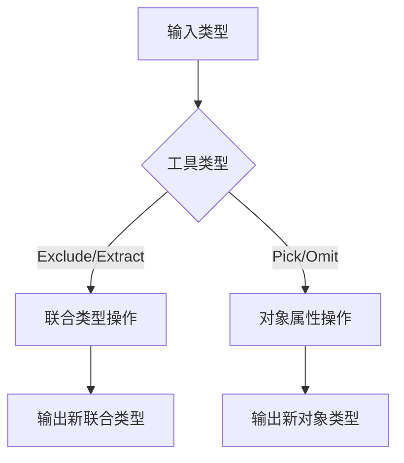
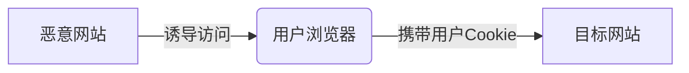

<!-- # <span style="color:#ccc">前端面试题总结</span>   -->

## <span style="color:#8B949E">CSS</span> 

### <span style="color:#FF6F00">伪类与伪元素区别</span>
  <div class="table-wrapper" markdown="block">

  | 对比项          | 伪类（Pseudo-classes）                     | 伪元素（Pseudo-elements）               |
  |:----------------|:------------------------------------------|:---------------------------------------|
  | **定义**        | 选择元素的特定**状态**                    | 选择元素的特定**部分**                  |
  | **语法**        | 单冒号 `:`（如 `:hover`）                 | 双冒号 `::`（如 `::before`，CSS3规范）  |
  | **作用目标**    | 整个元素（如链接的悬停状态）               | 元素的局部（如首字母、前后插入内容）      |
  | **常见示例**    | `:hover`, `:active`, `:nth-child(n)`     | `::before`, `::after`, `::first-line` |
  | **DOM 影响**    | 不修改 DOM 结构                           | 可创建虚拟 DOM 节点（如 `::before`）    |
  | **典型用途**    | 交互状态、结构选择                        | 内容修饰、文本特效                      |
  | **CSS3 规范**   | 保持单冒号（兼容旧语法）                  | 推荐双冒号（部分浏览器支持单冒号）        |
  | **JS 可操作**   | 可通过 JS 检测状态（如 `element.matches(':hover')` | 无法直接操作伪元素        |
  | **权重计算**    | 与类选择器同级（0,0,1,0）                | 与元素选择器同级（0,0,0,1）             |
  | **数量限制**    | 可叠加多个（如 `a:hover:active`）         | 一个选择器只能有一个伪元素（需分开写）    |

  </div>

代码示例对比：
  <div class="table-wrapper" markdown="block">

  | 类型       | 示例代码                          | 效果描述                     |
  |------------|----------------------------------|----------------------------|
  | **伪类**   | `a:hover { color: red; }`        | 鼠标悬停时链接变红           |
  | **伪元素** | `p::first-line { font-weight: bold; }` | 段落首行文字加粗          |
  | **组合使用** | `.box:hover::after { content: "!"; }` | 悬停时添加感叹号         |
  </div>

### <span style="color:#FF6F00">link 和@import 引入方式区别</span>


  <div class="table-wrapper" markdown="block">

  | 对比项       | `<link>`                                    | `@import`                                  |
  |--------------|---------------------------------------------|--------------------------------------------|
  | **语法**     | HTML 标签：`<link rel="stylesheet" href="style.css">` | CSS 规则：`@import url("style.css");`（必须写在 CSS 文件或 `<style>` 内部） |
  | **加载方式** | 并行加载，不阻塞 HTML 解析                  | 串行加载，需先解析当前 CSS 再加载目标文件，可能阻塞渲染 |
  | **兼容性**   | 所有浏览器                                  | CSS2.1+（IE5+ 支持，但现代优化特性受限）    |
  | **JS 控制**  | 可通过 JS 动态插入/修改                     | 无法直接操作，需修改 CSS 文件或 `<style>` 内容 |
  | **预加载**   | 支持 `<link rel="preload">`                 | 不支持                                     |
  | **适用场景** | 常规引入、性能优化、CDN 资源                | CSS 模块化、条件加载（如媒体查询）          |
  </div>

### <span style="color:#FF6F00"> css继承 </span>

  CSS 继承是指某些 CSS 属性会自动从父元素传递到子元素的机制，这使得开发者无需重复为子元素设置相同的样式。

📌 可继承属性 vs 不可继承属性

  <div class="table-wrapper" markdown="block">

  | 特性                | 可继承属性                                                                 | 不可继承属性                                                                 |
  |---------------------|---------------------------------------------------------------------------|-----------------------------------------------------------------------------|
  | **定义**            | 自动从父元素传递到子元素的样式属性                                           | 不会自动传递，需要显式设置的样式属性                                           |
  | **常见属性**        | `font-family`, `color`, `text-align`, `line-height`, `visibility`          | `width`, `height`, `margin`, `padding`, `background`, `border`, `position`  |
  | **控制方法**        | 默认自动继承                                                               | 需手动设置                                                                   |
  | **强制继承**        | 无需强制（默认继承）                                                       | 使用 `inherit` 关键字（如 `padding: inherit;`）                              |
  | **重置方法**        | `initial`（重置为默认值）                                                 | `initial` / `unset` / `revert`                                             |
  | **典型应用场景**    | 统一字体/文字样式（在 `body` 设置全局字体）                                 | 布局/盒模型属性（需单独控制）                                                 |
  | **性能影响**        | 减少重复代码，提升渲染效率                                                 | 过度使用 `inherit` 会增加样式计算复杂度                                       |
  | **调试技巧**        | 浏览器开发者工具中显示"Inherited from [父元素]"                            | 检查计算样式时显示明确赋值来源                                                |
  </div>

### <span style="color:#FF6F00"> 标准模型和 IE 模型的区别 </span>

  | 对比项          | 标准模型（W3C 盒模型）                     | IE 模型（怪异模式盒模型）               |
  |----------------|------------------------------------------|---------------------------------------|
  | **计算方式**    | `width` = 内容宽度                       | `width` = 内容 + padding + border     |
  | **总宽度公式**  | 总宽度 = width + padding + border + margin | 总宽度 = width + margin               |
  | **历史背景**    | CSS2 规范定义                            | IE5 及更早版本的默认行为               |
  | **触发方式**    | 文档有正确的 DOCTYPE 声明                | 无 DOCTYPE 或旧 HTML 文档触发怪异模式  |
  | **CSS3 控制**   | `box-sizing: content-box`（默认）        | `box-sizing: border-box`              |
  | **示例**        | ```css                                  | ```css                               |
  |                | .box {                                  | .box {                               |
  |                |   width: 200px;                         |   width: 200px;                      |
  |                |   padding: 20px;                        |   padding: 20px;                     |
  |                |   border: 10px solid;                   |   border: 10px solid;                |
  |                | } /* 实际宽度=200+40+20=260px */        | } /* 实际宽度=200px */               |
  |                | ```                                    | ```                                 |
  | **现代应用**    | 默认推荐                                 | 响应式布局中推荐使用 border-box       |
  | **兼容性**      | 所有现代浏览器                           | 需 box-sizing 显式声明                |

### <span style="color:#FF6F00"> BFC（Block Formatting Context，块级格式化上下文） </span>

  BFC 是 CSS 渲染过程中的一个独立布局环境，它决定了块级盒子如何布局，并控制其内部元素与外部元素的关系。BFC 就像一个隔离的容器，内部的布局规则不会影响外部，外部的布局也不会影响内部。

### 📌 BFC 核心特性

  <div class="table-wrapper" markdown="block">

  | 特性                | 说明                                                                 | 触发示例                     |
  |---------------------|---------------------------------------------------------------------|-----------------------------|
  | 独立渲染区域         | 内部布局不影响外部，外部不影响内部                                   | `overflow: hidden`          |
  | 阻止外边距合并       | 相邻块级元素的垂直`margin`不叠加                                     | `display: flow-root`        |
  | 包含浮动元素         | 父容器高度计算包含浮动子元素                                         | `float: left`               |
  | 阻止浮动覆盖         | BFC区域不与浮动元素重叠                                              | `position: absolute`        |

  </div>

### 🚀 BFC 触发方式对比

  <div class="table-wrapper" markdown="block">

  | 触发属性              | 推荐度 | 副作用                      | 适用场景                |
  |-----------------------|--------|----------------------------|-------------------------|
  | `display: flow-root`  | ✅ 首选 | 无                         | 现代浏览器项目          |
  | `overflow: hidden`    | ⚠️ 兼容 | 可能隐藏溢出内容            | 需要兼容旧浏览器        |
  | `float: left/right`   | ❌ 避免 | 破坏文档流                  | 特殊浮动布局            |
  | `position: absolute`  | ❌ 避免 | 脱离文档流                  | 绝对定位场景            |

  </div>

### 🔍 BFC 应用场景

  <div class="table-wrapper" markdown="block">

  | 问题                  | 解决方案                          | 代码示例                          |
  |-----------------------|----------------------------------|-----------------------------------|
  | 浮动高度塌陷           | 父元素触发BFC                    | ```css .parent { overflow: hidden; }``` |
  | 外边距合并             | 创建BFC隔离                      | ```html <div style="display:flow-root"><p>text</p></div>``` |
  | 两栏布局               | 非浮动侧触发BFC                  | ```css .right { overflow: auto; }``` |

  </div>

### 📜 BFC 布局规则对比

  <div class="table-wrapper" markdown="block">

  | 规则                | 普通流              | BFC环境              |
  |---------------------|--------------------|----------------------|
  | 浮动参与高度计算      | ❌ 不参与           | ✅ 参与               |
  | 垂直外边距合并        | ✅ 合并             | ❌ 不合并             |
  | 与浮动元素重叠        | ✅ 可能重叠         | ❌ 不重叠             |

  </div>

### ⚠️ 注意事项

  <div class="table-wrapper" markdown="block">

  | 情况                | 处理建议                          |
  |---------------------|----------------------------------|
  | 多层BFC嵌套         | 避免过度使用，增加渲染复杂度       |
  | 移动端适配          | 优先使用`display: flow-root`      |
  | 表格单元格          | 默认具有BFC特性，无需额外触发      |

  </div>

### 💡 最佳实践
  ```css
  /* 全局BFC设置 */
  .container {
    display: flow-root; /* 无副作用触发方式 */
  }
  /* 清除浮动兼容方案 */
  .clearfix::after {
    content: "";
    display: table;
    clear: both;
  }
  ```


### <span style="color:#FF6F00"> 未知高度元素垂直居中、垂直居中的实现方式有哪些 </span>

#### 📌 核心方案对比

  <div class="table-wrapper" markdown="block">

  | 方案                | 代码示例                                                                 | 兼容性   | 特点                     |
  |---------------------|-------------------------------------------------------------------------|---------|--------------------------|
  | **Flexbox**         | ```css.parent { display: flex; align-items: center; }```               | IE10+   | 最简单现代的方案          |
  | **Grid**            | ```css.parent { display: grid; place-items: center; }```               | IE不支持| 最简洁的写法             |
  | **绝对定位**| ```css.child { position: absolute; top: 0;left: 0;right: 0;left: 0; }``` | IE9+    | 兼容性最好的动态方案      |
  | **绝对定位+Transform**| ```css.child { position: absolute; top: 50%; transform: translateY(-50%); }``` | IE9+    | 兼容性最好的动态方案      |
  | **Table-Cell**      | ```css.parent { display: table-cell; vertical-align: middle; height: 100px; }``` | IE8+    | 兼容老旧浏览器   |

  </div>   

#### 💡 最佳实践推荐

#### 1. 现代项目首选（Flexbox）

  ```css
  .container {
    display: flex;
    align-items: center;  /* 垂直居中 */
    justify-content: center; /* 水平居中 */
    height: 300px; /* 需要明确高度 */
  }
  ```

### <span style="color:#FF6F00"> 移动端 1px 问题 </span>

#### 方案对比

<div class="table-wrapper" markdown="block">

  | 方案名称               | 实现原理                  | 优点                  | 缺点                  | 适用场景              | 代码示例                                                                 |
  |-----------------------|-------------------------|----------------------|----------------------|---------------------|-------------------------------------------------------------------------|
  | **伪元素+transform**  | 缩放伪元素边框            | 兼容性好，效果精准      | 需要额外DOM结构        | 通用场景              | ```css .border::after { transform: scaleY(0.5); }```                   |
  | **viewport缩放**      | 动态调整viewport缩放比例   | 一劳永逸              | 影响全局布局           | 简单页面              | ```js meta.content=`initial-scale=${1/window.devicePixelRatio}` ```    |
  | **border-image**      | 使用图片替代边框          | 无性能问题            | 修改颜色不便           | 固定颜色边框          | ```css border-image: url(border.png) 2 stretch; ```                     |
  | **渐变模拟**          | background渐变模拟边框    | 无DOM依赖            | 只支持单边            | 单边边框需求          | ```css background: linear-gradient(#000 50%,transparent 0) bottom repeat-x;``` | 
   </div>

#### 兼容性对比

 <div class="table-wrapper" markdown="block">

  | 方案                | iOS | Android | 微信浏览器 | 备注                  |
  |--------------------|-----|---------|-----------|----------------------|
  | transform缩放      | ✓   | ✓       | ✓         | 最稳定推荐方案         |
  | viewport缩放       | ✓   | △       | △         | 可能引起字体大小问题    |
  | border-image       | ✓   | ✓       | ✓         | 需准备多倍图           |
  | 渐变模拟           | ✓   | ✓       | ✓         | 仅适合简单边框         |

  </div>

#### 性能对比

 <div class="table-wrapper" markdown="block">

  | 方案                | 渲染性能 | 内存占用 | CPU消耗 | 综合评价 |
  |--------------------|---------|---------|--------|----------|
  | transform缩放      | ★★★★☆   | ★★★★☆   | ★★★☆☆  | 最佳平衡   |
  | viewport缩放       | ★★☆☆☆   | ★★★☆☆   | ★★☆☆☆  | 不推荐    |
  | border-image       | ★★★★☆   | ★★★☆☆   | ★★★★☆  | 适合静态   |
  | 渐变模拟           | ★★★★★   | ★★★★☆   | ★★★★★  | 性能最优   |

  </div>

### 💡 最佳实践代码

#### 1. 通用解决方案（推荐）
  ```css
  /* 四边1px边框 */
  .thin-border {
    position: relative;
  }
  .thin-border::after {
    content: "";
    position: absolute;
    top: 0;
    left: 0;
    width: 200%;
    height: 200%;
    border: 1px solid #000;
    transform: scale(0.5);
    transform-origin: 0 0;
    pointer-events: none;
  }
  ```
### <span style="color:#FF6F00"> 移动端适配方案 </span>

#### 📌 核心方案对比

 <div class="table-wrapper" markdown="block">

  | 方案               | 实现原理                | 优点                  | 缺点                  | 适用场景             | 代码示例                                                                 |
  |--------------------|------------------------|----------------------|----------------------|--------------------|-------------------------------------------------------------------------|
  | **Viewport缩放**   | 动态计算initial-scale   | 实现简单              | 影响所有元素           | 简单H5页面          | `<meta name="viewport" content="width=device-width, initial-scale=0.5">` |
  | **REM布局**        | 根字体动态变化          | 保持视觉比例           | 需要JS计算            | 复杂响应式页面       | `document.documentElement.style.fontSize = clientWidth / 7.5 + 'px'`    |
  | **VW/VH布局**      | 使用视窗单位            | 纯CSS实现             | 低版本兼容性差        | 现代浏览器项目       | `.box { width: 50vw; height: 20vh; }`                                  |
  | **Flexible.js**    | REM+viewport缩放        | 兼容性好              | 已停止维护            | 旧版浏览器兼容       | `<script src="//g.tbcdn.cn/mtb/lib-flexible/0.3.4/flexible.js"></script>` |

  </div>

#### 📊 技术指标对比

 <div class="table-wrapper" markdown="block">

  | 特性              | Viewport | REM    | VW/VH  | Flexible |
  |-------------------|---------|--------|--------|----------|
  | **需要JS**        | ❌       | ✅      | ❌      | ✅        |
  | **CSS单位**       | px      | rem    | vw/vh  | rem      |
  | **兼容性**        | IE9+    | IE9+   | IE11+  | IE6+     |
  | **维护成本**      | 低      | 中     | 低     | 中       |

  </div>

#### 💡 最佳实践示例
##### VW+REM混合方案
  ```css
  /* 设置根字体大小 */
  html {
    font-size: 13.3333vw;  /* 100vw/7.5 */
    font-size: calc(100vw / 7.5);
  }
  /* 使用rem单位 */
  .box {
    width: 2rem;  /* 设计稿100px */
  }

  ```

## <span id='JS' style="color:#8B949E">JS</span> 

### <span style="color:#FF6F00"> HTMl5 新特性 </span>

#### 📌 核心新特性对比表

 <div class="table-wrapper" markdown="block">

  | 分类            | 特性                  | 说明                                                                 | 代码示例                                                                 |
  |-----------------|-----------------------|---------------------------------------------------------------------|-------------------------------------------------------------------------|
  | **语义化标签**  | `<header>`            | 定义文档页眉                                                        | ```html <header><h1>网站标题</h1></header>```                          |
  |                 | `<nav>`               | 导航链接容器                                                        | ```html <nav><a href="/">首页</a></nav>```                             |
  |                 | `<article>`           | 独立内容区块                                                        | ```html <article><h2>文章标题</h2></article>```                        |
  | **媒体支持**    | `<audio>`/`<video>`   | 原生媒体播放支持                                                    | ```html <video src="movie.mp4" controls></video>```                    |
  | **图形绘制**    | `<canvas>`            | 通过JS绘制图形                                                      | ```html <canvas id="myCanvas" width="200" height="100"></canvas>```     |
  |                 | `<svg>`               | 矢量图形绘制                                                        | ```html <svg width="100" height="100"><circle cx="50" cy="50" r="40"/></svg>``` |
  | **表单增强**    | 新增`input`类型       | email/url/date/time等                                               | ```html <input type="date" name="birthday">```                         |
  |                 | 表单验证属性          | required/pattern等                                                  | ```html <input type="text" required pattern="[A-Za-z]{3}">```          |
  | **存储**        | localStorage          | 本地持久化存储                                                      | ```js localStorage.setItem('key', 'value')```                           |
  |                 | sessionStorage        | 会话级存储                                                          | ```js sessionStorage.getItem('key')```                                  |
  | **API**         | Geolocation API       | 获取地理位置                                                        | ```js navigator.geolocation.getCurrentPosition(showPosition)```        |
  |                 | Web Workers           | 多线程处理                                                          | ```js const worker = new Worker('worker.js')```                         |

  </div>

#### 🚀 其他重要特性

 <!-- <div class="table-wrapper" markdown="block"> -->

  | 特性                  | 说明                                                                 | 兼容性       |
  |-----------------------|---------------------------------------------------------------------|-------------|
  | **WebSocket**         | 全双工通信协议                                                      | IE10+       |
  | **WebRTC**            | 实时音视频通信                                                      | Chrome/Firefox |
  | **Drag & Drop API**   | 原生拖放接口                                                        | IE9+        |
  | **History API**       | 操作浏览器历史记录                                                  | IE10+       |
  | **Web Components**    | 创建可重用自定义元素                                                | Chrome/Firefox |

  <!-- <div> -->

#### 💡 代码示例集
  ```html
  <!-- 语义化结构示例 -->
  <body>
    <header>...</header>
    <nav>...</nav>
    <main>
      <article>...</article>
      <aside>...</aside>
    </main>
    <footer>...</footer>
  </body>

  <!-- 视频播放器示例 -->
  <video controls width="400">
    <source src="movie.mp4" type="video/mp4">
    <track kind="subtitles" src="subs.vtt" srclang="zh">
  </video>

  <!-- Canvas绘图示例 -->
  <canvas id="gameCanvas"></canvas>
  <script>
    const ctx = document.getElementById('gameCanvas').getContext('2d');
    ctx.fillStyle = 'red';
    ctx.fillRect(10, 10, 100, 100);
  </script>
  ```

### <span style="color:#FF6F00"> Canvas 与 SVG 的区别 </span>

#### 📌 核心特性对比

<div class="table-wrapper" markdown="block">

  | 特性                | Canvas                          | SVG                           |
  |---------------------|--------------------------------|-------------------------------|
  | **类型**            | 位图（像素操作）                 | 矢量图（XML描述）              |
  | **渲染方式**        | 即时渲染（绘制后不可修改）         | 保留模式（DOM可随时修改）       |
  | **API**             | 基于JavaScript绘图API           | 基于XML的标记语言              |
  | **事件处理**        | 不支持（需手动计算坐标）           | 支持（DOM事件模型）             |
  | **性能**            | 适合高频重绘（如游戏）            | 适合静态/少量动态图形           |
  | **缩放表现**        | 会失真（像素放大）                | 无损缩放                       |
  | **适用场景**        | 数据可视化/游戏/图像处理           | 图标/地图/可交互图表            |

</div>

<span></span>

#### 💻 代码实现对比

<div class="table-wrapper" markdown="block">

  | 功能                | Canvas 示例                     | SVG 示例                      |
  |---------------------|--------------------------------|-------------------------------|
  | **绘制矩形**        | ```js ctx.fillRect(10,10,50,50)``` | ```xml <rect x="10" y="10" width="50" height="50"/>``` |
  | **绘制圆形**        | ```js ctx.arc(75,75,50,0,Math.PI*2)``` | ```xml <circle cx="75" cy="75" r="50"/>``` |
  | **添加文本**        | ```js ctx.fillText("Hello",10,50)``` | ```xml <text x="10" y="50">Hello</text>``` |
  | **动画实现**        | 需手动清除重绘                   | 可使用CSS/SMIL动画             |

</div>

#### 🚀 技术指标对比

 <div class="table-wrapper" markdown="block">

  | 指标                | Canvas                          | SVG                           |
  |---------------------|--------------------------------|-------------------------------|
  | **DOM支持**         | 无DOM节点                      | 完整DOM支持                   |
  | **内存占用**        | 低（无DOM树）                  | 较高（维护DOM结构）            |
  | **浏览器支持**      | IE9+                           | IE9+（部分特性需IE11+）        |
  | **导出格式**        | PNG/JPG（位图）                | PNG/SVG（矢量）               |
  | **可访问性**        | 较差（需额外ARIA）              | 原生支持无障碍                 |

  </div>

#### 🌟 选择指南

 <div class="table-wrapper" markdown="block">

  | 需求场景            | 推荐技术                        | 原因                          |
  |---------------------|--------------------------------|-------------------------------|
  | 动态数据可视化       | Canvas                         | 高性能大数据量渲染             |
  | 可交互地图          | SVG                            | 支持点击事件和复杂路径          |
  | 游戏开发            | Canvas（WebGL）                | 需要帧级控制                   |
  | 响应式图标          | SVG                            | 矢量无损缩放                   |
  | 图像滤镜处理        | Canvas                         | 像素级操作能力                 |

  </div>

#### ⚠️ 注意事项
1. **Canvas 必须设置宽高属性**
   ```html
   <!-- 正确 -->
   <canvas width="800" height="600"></canvas>
   
   <!-- 错误（会拉伸变形）-->
   <canvas style="width:800px;height:600px;"></canvas>
    ```
### <span style="color:#FF6F00"> for...of 和 for...in 区别 </span>

#### 1. 基本定义对比

 <div class="table-wrapper" markdown="block">

  | **特性**         | `for...of`                          | `for...in`                          |
  |------------------|-------------------------------------|-------------------------------------|
  | **ES版本**       | ES6 (ECMAScript 2015)               | ES1 (ECMAScript 1st Edition)        |
  | **迭代目标**     | 可迭代对象的值                      | 对象的可枚举属性                    |
  | **原型链**       | 不遍历原型链                        | 会遍历原型链上的可枚举属性          |
  | **适用数据类型** | Array, Map, Set, String等可迭代对象 | 普通对象(Object)                     |

  </div>

#### 2. 代码示例对比

#### 2.1 数组遍历
  ```javascript
  const arr = ['a', 'b', 'c'];

  // for...of 获取值
  for (const value of arr) {
    console.log(value); // 输出: 'a', 'b', 'c'
  }

  // for...in 获取索引/键
  for (const key in arr) {
    console.log(key);   // 输出: '0', '1', '2'
  }
  ```

#### 2.2 对象遍历

  ```javascript
  const obj = { name: 'Alice', age: 25 };

  // for...of ❌ 报错（普通对象不可迭代）
  // for (const value of obj) { }

  // for...in 获取属性名
  for (const key in obj) {
    console.log(key); // 输出: 'name', 'age'
  }
  ```

#### 2.3 原型链差异

  ```javascript
  Array.prototype.customMethod = function() {};

  const arr = [1, 2, 3];

  // for...of 不受影响
  for (const val of arr) {
    console.log(val); // 输出: 1, 2, 3
  }

  // for...in 会包含原型方法
  for (const key in arr) {
    console.log(key); // 输出: '0', '1', '2', 'customMethod'
  }
  ```

#### 错误使用案例

  ```javascript
  // 错误：用for...in遍历数组值
  const arr = [10, 20, 30];
  let sum = 0;
  for (const num in arr) { // num是字符串索引！
    sum += num; // 实际是字符串拼接：'0' + '1' + '2'
  }

  // 正确：应使用for...of
  for (const num of arr) {
    sum += num; // 60
  }
  ```

### <span style="color:#FF6F00"> Set Map 区别 </span>

#### 📌 核心特性对比

 <div class="table-wrapper" markdown="block">

  | 特性                | Set                          | Map                           |
  |---------------------|------------------------------|-------------------------------|
  | **数据结构**        | 值集合（唯一值）              | 键值对集合（唯一键）            |
  | **初始化**          | `new Set([iterable])`        | `new Map([ [key,val],... ])`  |
  | **元素访问**        | 只能检查存在性（`has()`）     | 通过键直接获取值（`get(key)`）  |
  | **去重机制**        | 自动去重（`===`严格相等）     | 键唯一（基于`===`比较）         |
  | **迭代顺序**        | 插入顺序                      | 插入顺序                       |
  | **典型用途**        | 去重/集合运算                 | 字典/关联数据存储               |

  </div>

#### 💻 基础操作对比

 <div class="table-wrapper" markdown="block">

  | 操作                | Set 示例                     | Map 示例                      |
  |---------------------|-----------------------------|-------------------------------|
  | **创建**            | `const s = new Set()`       | `const m = new Map()`         |
  | **添加元素**        | `s.add(value)`              | `m.set(key, value)`           |
  | **删除元素**        | `s.delete(value)`           | `m.delete(key)`               |
  | **检查存在**        | `s.has(value)`              | `m.has(key)`                  |
  | **获取大小**        | `s.size`                    | `m.size`                      |
  | **清空集合**        | `s.clear()`                 | `m.clear()`                   |
  | **遍历元素**        | `s.forEach(v => ...)`       | `m.forEach((v,k) => ...)`     |

  </div>

#### 🚀 高级特性对比

 <div class="table-wrapper" markdown="block">

  | 功能                | Set                          | Map                           |
  |---------------------|------------------------------|-------------------------------|
  | **构造时初始化**    | 接受数组/可迭代对象           | 接受`[key,value]`数组          |
  | **键类型限制**      | 任意值（除`-0`和`+0`视为相同） | 任意值（包括对象引用）          |
  | **值类型限制**      | 不适用（只有键）              | 任意值                        |
  | **转换数组**        | `[...set]` / `Array.from(set)` | `[...map]`（得到键值对数组）   |
  | **Weak版本**        | `WeakSet`（弱引用集合）       | `WeakMap`（弱引用字典）        |

</div>

#### 🌟 使用场景对比

 <div class="table-wrapper" markdown="block">

  | 场景                | 推荐使用                     | 原因                          |
  |---------------------|-----------------------------|-------------------------------|
  | 数据去重            | Set                         | 自动去重简单高效               |
  | 关联数据存储         | Map                         | 键值对天然匹配                 |
  | DOM节点标记         | WeakSet                     | 避免内存泄漏                   |
  | 私有数据存储         | WeakMap                     | 键为对象时不阻止GC             |
  | 集合运算（并/交/差） | Set                         | 原生支持`union`/`intersection` |

</div>

#### 💡 代码示例
  ```javascript
  // Set 典型用法
  const unique = [...new Set([1,2,2,3])]; // [1,2,3]
  const setA = new Set([1,2,3]);
  const setB = new Set([2,3,4]);
  const union = new Set([...setA, ...setB]); // {1,2,3,4}

  // Map 典型用法
  const map = new Map([ ['key1', 'value1'], [objKey, 42] ]);
  map.set(Symbol('id'), 100);
  console.log(map.get(objKey)); // 42

  // WeakMap 私有数据
  const privateData = new WeakMap();
  class Person {
    constructor(name) {
      privateData.set(this, { name });
    }
    getName() {
      return privateData.get(this).name;
    }
  }
  ```

### <span style="color:#FF6F00"> JS 中内存泄漏几种情况 </span>

#### 📌 内存泄漏主要场景对比

 <div class="table-wrapper" markdown="block">

  | 泄漏类型            | 产生原因                                                                 | 代码示例                                                                 | 解决方案                                                                 |
  |---------------------|-------------------------------------------------------------------------|-------------------------------------------------------------------------|-------------------------------------------------------------------------|
  | **意外的全局变量**  | 未声明的变量或`this`指向改变                                            | ```js function fn() { leakVar = 'xxx'; this.leakProp = 'yyy' }```       | 使用严格模式`'use strict'`，通过ESLint检测                               |
  | **未清理的定时器**  | `setInterval`/`setTimeout`未清除                                        | ```js const timer = setInterval(()=>{}, 1000); // 未clearInterval```    | 组件卸载时清理：`clearInterval(timer)`                                  |
  | **DOM引用未释放**   | 保留对已移除DOM的引用                                                   | ```js const elements = { button: document.getElementById('btn') }; document.body.removeChild(btn);``` | 手动置空：`elements.button = null`                                     |
  | **闭包滥用**        | 函数内部变量被外部引用                                                   | ```js function outer() { const bigData = new Array(1e6); return () => bigData; }``` | 避免过度使用闭包，及时解除引用                                         |
  | **事件监听未移除**  | 未正确使用`removeEventListener`                                         | ```js window.addEventListener('resize', onResize); // 未移除```         | 使用弱引用`WeakRef`或组件卸载时移除                                     |
  | **缓存无限增长**    | 缓存对象未设置上限                                                       | ```js const cache = {}; function setCache(k,v) { cache[k] = v; }```     | 使用LRU缓存策略，设置最大条目数                                         |

  </div>

#### 🚀 检测与调试方法

 <div class="table-wrapper" markdown="block">

  | 工具/方法           | 使用方式                                                                 | 适用场景                                                                 |
  |---------------------|-------------------------------------------------------------------------|-------------------------------------------------------------------------|
  | **Chrome DevTools** | Memory面板拍摄堆快照对比                                                 | 定位泄漏源                                                              |
  | **Performance**     | 录制内存变化曲线                                                         | 观察内存增长趋势                                                        |
  | `process.memoryUsage()` | Node.js内存监控                                                        | 服务端内存泄漏检测                                                      |
  | **WeakMap**         | 使用弱引用存储临时数据                                                   | 防止第三方库导致泄漏                                                    |

  </div>

#### 💡 最佳实践代码示例
  ```javascript
  // 1. 避免全局变量
  (function() {
    'use strict';
    let localVar = 'safe';
  })();

  // 2. 清理定时器（React示例）
  useEffect(() => {
    const timer = setInterval(() => {}, 1000);
    return () => clearInterval(timer);
  }, []);

  // 3. 弱引用DOM（现代API）
  const ref = new WeakRef(document.getElementById('btn'));
  const btn = ref.deref();
  if (btn) btn.addEventListener('click', handler);

  // 4. 有限缓存实现
  class LRUCache {
    constructor(maxSize) {
      this.maxSize = maxSize;
      this.cache = new Map();
    }
    get(key) {
      if (!this.cache.has(key)) return null;
      const value = this.cache.get(key);
      this.cache.delete(key);
      this.cache.set(key, value);
      return value;
    }
  }
  ```

### <span style="color:#FF6F00"> 如何判断数组和对象 </span>

#### 📌 基础判断方法

 <div class="table-wrapper" markdown="block">

  | 方法                     | 数组示例                          | 对象示例                          | 返回值       | 说明                  |
  |--------------------------|----------------------------------|----------------------------------|-------------|-----------------------|
  | **typeof**               | `typeof []`                     | `typeof {}`                     | `"object"`  | 无法区分              |
  | **instanceof**           | `[] instanceof Array`           | `{} instanceof Object`          | `true/false`| 跨iframe失效          |
  | **constructor**          | `[].constructor === Array`      | `{}.constructor === Object`     | `true/false`| 可被修改              |
  | **Array.isArray()**      | `Array.isArray([])`             | `Array.isArray({})`             | `true/false`| ES5+推荐              |
  | **Object.prototype.toString** | `Object.prototype.toString.call([])` | `Object.prototype.toString.call({})` | `"[object Array]"`/`"[object Object]"` | 最可靠        |

  </div>

#### 💡 最佳实践代码
  ```javascript
  // 安全判断数组
  function isArray(target) {
    return Array.isArray ? Array.isArray(target) : 
      Object.prototype.toString.call(target) === '[object Array]';
  }

  // 判断纯对象（排除null/array/date等）
  function isPlainObject(obj) {
    return Object.prototype.toString.call(obj) === '[object Object]' &&
      obj !== null &&
      Object.getPrototypeOf(obj) === Object.prototype;
  }
  ```


### <span style="color:#FF6F00"> instanceof 和 typeof 区别 </span>

#### 📌 核心区别

 <div class="table-wrapper" markdown="block">

  | 特性               | `typeof`                          | `instanceof`                      |
  |--------------------|----------------------------------|----------------------------------|
  | **作用**           | 返回操作数的基本类型字符串          | 检测构造函数的`prototype`是否在对象原型链上 |
  | **返回值**         | `"string"`/`"number"`/`"boolean"`等 | `true`/`false`                  |
  | **操作数**         | 任意值                            | 左操作数：对象<br>右操作数：构造函数    |
  | **主要用途**       | 基本类型判断                      | 对象类型继承关系判断               |

  </div>

#### 💻 使用示例对比

 <div class="table-wrapper" markdown="block">

  | 判断目标           | `typeof` 用法                 | `instanceof` 用法             | 结果差异说明            |
  |--------------------|------------------------------|------------------------------|-----------------------|
  | 数字               | `typeof 42`                  | `42 instanceof Number`       | `"number"` vs `false` |
  | 字符串             | `typeof "text"`              | `"text" instanceof String`   | `"string"` vs `false` |
  | 布尔值             | `typeof true`                | `true instanceof Boolean`    | `"boolean"` vs `false`|
  | 数组               | `typeof []`                  | `[] instanceof Array`        | `"object"` vs `true`  |
  | 对象               | `typeof {}`                  | `{} instanceof Object`       | `"object"` vs `true`  |
  | null              | `typeof null`                | `null instanceof Object`     | `"object"` vs `false` |
  | 函数               | `typeof function(){}`        | `(function(){}) instanceof Function` | `"function"` vs `true` |
  | 未定义            | `typeof undefined`           | `undefined instanceof Object` | `"undefined"` vs `false` |

  </div>

  #### 🚀 特殊案例对比

   <div class="table-wrapper" markdown="block">

  | 场景                | `typeof` 表现               | `instanceof` 表现            | 原因分析               |
  |--------------------|----------------------------|-----------------------------|-----------------------|
  | 包装对象            | `typeof new Number(1)`     | `new Number(1) instanceof Number` | `"object"` vs `true`  |
  | 跨iframe对象        | `typeof iframeArray`       | `iframeArray instanceof Array` | 正常返回 vs 可能`false` |
  | 自定义类            | `typeof new MyClass()`     | `new MyClass() instanceof MyClass` | `"object"` vs `true`  |

  </div>

  #### ⚠️ 注意事项

   <div class="table-wrapper" markdown="block">

  | 问题                | `typeof` 风险              | `instanceof` 风险           | 解决方案               |
  |--------------------|---------------------------|----------------------------|-----------------------|
  | null误判           | `typeof null === "object"` | 无此问题                   | 额外检查`=== null`     |
  | 基本类型检测        | 有效                      | 对基本类型始终返回`false`    | 配合`constructor`检查  |
  | 原型链修改影响      | 不受影响                  | 结果可能被修改              | 慎改`__proto__`       |

  </div>

#### 💡 最佳实践
  ```javascript
  // 基本类型检测用 typeof
  function isString(value) {
    return typeof value === 'string' || value instanceof String;
  }

  // 引用类型检测用 instanceof + 构造函数检查 （instanceof可以准确判断Date类型 typeof无法判断）
  function isDate(value) {
    return value instanceof Date || 
      (value && Object.prototype.toString.call(value) === '[object Date]');
  }

  // 安全类型判断函数
  function getType(value) {
    if (value === null) return 'null';
    const type = typeof value;
    return type !== 'object' ? type : 
      Object.prototype.toString.call(value).slice(8, -1).toLowerCase();
  }

  ```

### <span style="color:#FF6F00"> 0.1+0.2为什么不等于0.3 </span>


#### 1. 根本原因：IEEE 754 浮点数标准（小数最多展示52位）

  JavaScript 采用 **IEEE 754 双精度浮点数** 表示数字（64位）：小数最多展示52位


#### 2. 二进制表示问题

#### 2.1 十进制转二进制
  ```javascript
  // 0.1 的二进制表示
  0.1 → 0.0001100110011001100110011001100110011001100110011001101... (无限循环)

  // 0.2 的二进制表示
  0.2 → 0.001100110011001100110011001100110011001100110011001101... (无限循环)
  ```
  #### 2.2 存储截断误差

  #### 3. 计算过程分析
  ```javascript

  // 实际计算步骤：
  0.1 (存储值)
  + 0.2 (存储值)
  = 0.300000000000000044408920985006... (二进制加法结果)
  ≈ 0.30000000000000004 (最终显示值)
  ```

#### 4. 解决方案对比

#### 1. 常用解决方案对比

 <div class="table-wrapper" markdown="block">

  | **解决方案**        | **实现代码示例**                                                                 | **优点**                          | **缺点**                          | **适用场景**               |
  |---------------------|---------------------------------------------------------------------------------|-----------------------------------|-----------------------------------|---------------------------|
  | **toFixed()**       | `parseFloat((0.1 + 0.2).toFixed(1)) === 0.3`                                    | 简单易用                          | 返回字符串需转换，会四舍五入      | 简单显示场景               |
  | **乘除法**          | `(0.1 * 10 + 0.2 * 10) / 10 === 0.3`                                           | 保持数字类型                      | 需提前知道精度位数                | 已知固定精度的计算         |
  | **Number.EPSILON**  | `Math.abs(0.1 + 0.2 - 0.3) < Number.EPSILON`                                   | 高精度比较                        | 不能直接修正计算值                | 科学计算比较               |
  | **Math.round()**    | `Math.round((0.1 + 0.2) * 1e10) / 1e10 === 0.3`                                | 可控制精度                        | 大数运算可能溢出                  | 需要指定精度的计算         |
  | **第三方库**        | `new Decimal(0.1).plus(0.2).equals(0.3)`                                       | 完美解决精度问题                  | 增加项目体积                      | 金融/财务系统             |

  </div>

#### 2. 方案实现细节对比

#### 2.1 精度修正方案
  ```javascript
  // 方案1：toFixed + parseFloat
  const result1 = parseFloat((0.1 + 0.2).toFixed(10));

  // 方案2：放大为整数计算
  const result2 = (0.1 * 1000 + 0.2 * 1000) / 1000;

  // 方案3：ES6 Number.EPSILON比较
  const isEqual = Math.abs(0.1 + 0.2 - 0.3) < Number.EPSILON;
  ```

  #### 2.2 现代JavaScript方案
  ```javascript
  // ES6 Number.EPSILON 比较
  function floatEqual(a, b) {
    return Math.abs(a - b) < Number.EPSILON;
  }

  floatEqual(0.1 + 0.2, 0.3); // true
  ```

### <span style="color:#FF6F00"> 如何判断一个空对象 </span>

#### 📌 空对象判断方案对比

 <div class="table-wrapper" markdown="block">

  | 方法                     | 代码示例                                                                 | 优点                  | 缺点                  |
  |--------------------------|-------------------------------------------------------------------------|----------------------|----------------------|
  | **Object.keys()**        | `Object.keys(obj).length === 0`                                        | ES5+标准方法          | 不检查不可枚举属性     |
  | **JSON.stringify()**     | `JSON.stringify(obj) === '{}'`                                         | 简单直观              | 性能较差，忽略`undefined` |
  | **for...in循环**         | `function isEmpty(obj) { for(let key in obj) return false; return true; }` | 检查所有可枚举属性     | 手动实现较繁琐         |
  | **Object.getOwnPropertyNames()** | `Object.getOwnPropertyNames(obj).length === 0`                     | 包含不可枚举属性       | ES5+，性能中等        |
  | **Reflect.ownKeys()**    | `Reflect.ownKeys(obj).length === 0`                                    | 包含Symbol键          | ES6+，兼容性要求高     |

  </div>

#### 💡 最佳实践代码
  ```javascript
  // 方法1：推荐方案（检查可枚举属性）
  function isEmpty(obj) {
    return Object.keys(obj).length === 0;
  }

  // 方法2：严格方案（包含不可枚举属性和Symbol键）
  function isEmptyStrict(obj) {
    return Reflect.ownKeys(obj).length === 0 && 
          Object.getPrototypeOf(obj) === Object.prototype;
  }

  // 方法3：兼容IE8的方案
  function isEmptyLegacy(obj) {
    for (var key in obj) {
      if (obj.hasOwnProperty(key)) return false;
    }
    return true;
  }
  ```


#### 🌟 特殊案例处理

 <div class="table-wrapper" markdown="block">

  | 场景                | 问题                          | 解决方案                                                                 |
  |---------------------|------------------------------|-------------------------------------------------------------------------|
  | **原型链属性**      | `Object.keys`不检查原型链      | 使用`for...in`+`hasOwnProperty`或`Object.getOwnPropertyNames()`         |
  | **Symbol键**        | `Object.keys`忽略Symbol       | 使用`Reflect.ownKeys()`                                                |
  | **非纯对象**        | 如`Date`/`Array`实例          | 先判断对象类型：`Object.prototype.toString.call(obj) === '[object Object]'` |

</div>

#### ⚠️ 常见误区
  ```javascript
  // 错误1：直接判断{}（引用地址不同）
  console.log(obj === {}); // 永远false

  // 错误2：用typeof区分
  console.log(typeof {} === 'object'); // 数组/null也会返回true

  // 错误3：jQuery误用
  console.log($.isEmptyObject({})); // 仅适用于jQuery环境
  ```

#### 📊 性能对比（百万次操作）
  | 方法                | 耗时(ms) | 适用场景              |
  |---------------------|---------|----------------------|
  | `Object.keys()`     | 120     | 现代浏览器常规使用      |
  | `for...in`         | 250     | 需要检查原型链时        |
  | `JSON.stringify()`  | 1800    | 不推荐用于性能敏感场景  |
  | `Reflect.ownKeys()` | 150     | 需要检查Symbol键时     |

#### 🚀 扩展方案（ES6+）
  ```javascript
  // 使用Object.entries()
  function isEmpty(obj) {
    return Object.entries(obj).length === 0;
  }

  // 使用Proxy检测动态对象
  const emptyChecker = new Proxy({}, {
    get(target, prop) {
      return () => false;
    }
  });
  console.log(emptyChecker.anyProp()); // false
  ```


### <span style="color:#FF6F00"> defer 和 async 区别 </span>

#### 📌 核心特性对比

 <div class="table-wrapper" markdown="block">

  | 特性                | `<script defer>`                  | `<script async>`                 | 普通 `<script>`            |
  |---------------------|----------------------------------|----------------------------------|---------------------------|
  | **下载时机**        | 立即下载，不阻塞HTML解析           | 立即下载，不阻塞HTML解析           | 立即下载并阻塞HTML解析       |
  | **执行时机**        | HTML解析完成后，DOMContentLoaded前 | 下载完成后立即执行（可能阻塞HTML解析） | 下载后立即执行并阻塞HTML解析 |
  | **执行顺序**        | 保持文档顺序                       | 无序（先下载完先执行）              | 按文档顺序                 |
  | **适用场景**        | 依赖DOM的脚本                      | 独立第三方脚本（如统计代码）         | 需要立即执行的脚本           |
  </div>


#### 💻 代码示例对比

 <div class="table-wrapper" markdown="block">

  | 加载方式            | HTML 代码示例                     | 执行流程图解                     |
  |---------------------|----------------------------------|--------------------------------|
  | **defer**           | `<script src="a.js" defer></script>` | HTML解析 → 下载脚本 → DOM构建完成 → 按序执行 |
  | **async**           | `<script src="b.js" async></script>` | HTML解析 → 下载脚本 → 下载完立即执行（无序） |
  | **普通script**      | `<script src="c.js"></script>`     | HTML解析暂停 → 下载执行 → 继续解析 |

  </div>

#### 🚀 技术指标对比

 <div class="table-wrapper" markdown="block">

  | 指标                | defer                          | async                         | 普通script                  |
  |---------------------|--------------------------------|-------------------------------|-----------------------------|
  | **IE支持**          | IE10+                          | IE10+                         | 全支持                      |
  | **是否阻塞解析**     | 否                             | 可能阻塞（执行时）             | 是                          |
  | **DOMContentLoaded** | 在其前执行                     | 可能在其前后执行               | 在其前执行                   |
  | **推荐使用位置**     | `<head>`中声明                 | `<head>`或`<body>`            | `<body>`底部                |

</div>

#### 💡 最佳实践
  ```html
  <!-- 正确用法示例 -->
  <head>
    <!-- 需要DOM的脚本用defer -->
    <script src="main.js" defer></script>
    
    <!-- 独立脚本用async -->
    <script src="analytics.js" async></script>
  </head>
  <body>
    <!-- 非关键脚本放body底部 -->
    <script src="non-critical.js"></script>
  </body>
  ```


#### ⚠️ 常见误区

 <div class="table-wrapper" markdown="block">

  | 错误用法            | 问题分析                      | 正确做法                  |
  |---------------------|-----------------------------|--------------------------|
  | `defer+async`同时用 | 浏览器会忽略`async`           | 只选其一（优先`defer`）   |
  | 动态插入的script     | 默认行为类似`async`           | 显式设置`script.async = false` |
  | 多个`async`脚本依赖 | 可能因执行顺序出错             | 改用`defer`或打包合并     |

  </div>

#### 🌟 执行时序图示
```mermaid
  graph TD
      A[HTML解析] --> B[遇到script]

      B --> C{属性?}

      C -->|defer| D[后台下载]

      C -->|async| E[后台下载]

      C -->|无| F[阻塞解析并执行]

      D --> G[DOMContentLoaded前按序执行]

      E --> H[下载完立即执行]
  ```
  #### 📊 性能影响对比
  | 场景                | defer       | async       | 普通script  |
  |---------------------|------------|------------|------------|
  | 首屏时间             | ✅ 最优      | ⚠️ 可能延迟  | ❌ 最差      |
  | 脚本执行可靠性        | ✅ 顺序保证   | ❌ 无序      | ✅ 顺序保证   |
  | 第三方脚本适用性      | ⚠️ 需DOM时用 | ✅ 推荐      | ❌ 不推荐    |

  > **黄金法则**：  

  > - **关键脚本** → 用`defer`（如页面初始化逻辑）  

  > - **独立脚本** → 用`async`（如统计/广告代码） 

  > - **兼容IE9-** → 普通script放`</body>`前  

  > - **动态加载** → 显式设置`script.async = false`保持顺序

### <span style="color:#FF6F00"> this apply、call、bind 区别 </span>

#### 📌 核心区别对比

 <div class="table-wrapper" markdown="block">

  | 方法       | 调用方式                      | 参数传递形式           | 执行时机       | 返回值          | 应用场景                     |
  |------------|-----------------------------|----------------------|--------------|----------------|----------------------------|
  | **call**   | `func.call(thisArg, arg1, arg2)` | 逐个参数传递          | 立即执行       | 函数返回值       | 需要明确this和参数列表时       |
  | **apply**  | `func.apply(thisArg, [argsArray])` | 数组形式传递          | 立即执行       | 函数返回值       | 参数数量不确定/已有数组时       |
  | **bind**   | `func.bind(thisArg, arg1, arg2)` | 逐个参数传递          | 返回绑定后的函数 | 新的绑定函数     | 需要延迟执行/事件回调绑定this时 |

  </div>

#### 💻 代码示例对比

 <div class="table-wrapper" markdown="block">

  | 场景                | call 示例                     | apply 示例                    | bind 示例                     |
  |---------------------|------------------------------|------------------------------|------------------------------|
  | **基本用法**        | `sayHi.call(user, 'Hello')`  | `sayHi.apply(user, ['Hello'])` | `const bound = sayHi.bind(user); bound('Hello')` |
  | **参数传递**        | `Math.max.call(null, 1, 2, 3)` | `Math.max.apply(null, [1, 2, 3])` | `const max = Math.max.bind(null, 1); max(2, 3)` |
  | **构造函数绑定**     | `Animal.call(this, name)`    | `Animal.apply(this, [name])`  | `const BoundAnimal = Animal.bind(this); new BoundAnimal(name)` |

  </div>

#### 🚀 技术特性对比

 <div class="table-wrapper" markdown="block">

  | 特性                | call                          | apply                         | bind                          |
  |---------------------|-------------------------------|-------------------------------|-------------------------------|
  | **ES版本**          | ES3                           | ES3                           | ES5                           |
  | **性能**            | 较快（直接调用）               | 较慢（需解构数组）             | 最慢（需创建新函数）            |
  | **链式调用**        | 不支持                        | 不支持                        | 支持（返回函数）               |
  | **箭头函数**        | 无效（无法改变this）           | 无效                          | 无效                          |

</div>

#### 💡 最佳实践
  ```javascript
  // 1. 借用数组方法（类数组转数组）
  const slice = Array.prototype.slice;
  const args = slice.call(arguments); // 或 slice.apply(arguments)

  // 2. 组合继承（构造函数绑定）
  function Sub(name) {
    Super.call(this, name); // 等价于 apply
    this.subProp = value;
  }

  // 3. 事件回调绑定this（React示例）
  class Button extends React.Component {
    handleClick = this.handleClick.bind(this);
    // 或使用箭头函数：handleClick = () => {...}
  }
  ```


#### ⚠️ 常见误区

 <div class="table-wrapper" markdown="block">

  | 错误用法            | 问题分析                      | 正确做法                  |
  |---------------------|-----------------------------|--------------------------|
  | `obj.method.call(null)` | 丢失this指向                | `obj.method.call(obj)`   |
  | `bind()`后立即调用    | 失去bind的意义               | 先绑定后调用              |
  | 多层bind            | 只有第一次bind生效            | 避免链式bind              |

  </div>

  #### 🌟 特殊技巧
  ```javascript
  // 1. 柯里化（参数复用）
  const add = (a, b) => a + b;
  const add10 = add.bind(null, 10);
  console.log(add10(5)); // 15

  // 2. 快速调用原生方法
  const log = console.log.call.bind(console.log);
  log('Hello'); // 等价于 console.log('Hello')

  // 3. 安全调用（避免null/undefined报错）
  function safeCall(fn, thisArg, ...args) {
    return fn?.apply(thisArg || null, args);
  }
  ```

### <span style="color:#FF6F00"> 构造函数 new 之后都做了什么 </span>

#### 📌 `new` 操作符的核心步骤

 <div class="table-wrapper" markdown="block">

  | 步骤 | 操作描述                                                                 | 代码等效实现                                                                 |
  |------|--------------------------------------------------------------------------|-----------------------------------------------------------------------------|
  | 1    | **创建空对象**                                                            | `const obj = Object.create(constructor.prototype)`                          |
  | 2    | **绑定原型链**                                                            | `obj.__proto__ = constructor.prototype`                                     |
  | 3    | **绑定this并执行构造函数**                                                 | `constructor.apply(obj, args)`                                              |
  | 4    | **处理返回值**                                                            | `return typeof result === 'object' ? result : obj`                          |

  </div>

#### 💡 完整模拟实现
  ```javascript
  function myNew(constructor, ...args) {
    // 步骤1：创建新对象并绑定原型
    const obj = Object.create(constructor.prototype);
    
    // 步骤2：执行构造函数（绑定this）
    const result = constructor.apply(obj, args);
    
    // 步骤3：处理返回值
    return result instanceof Object ? result : obj;
  }

  // 使用示例
  function Person(name) {
    this.name = name;
  }
  const p = myNew(Person, '张三');
  ```

### <span style="color:#FF6F00"> 箭头函数为什么不能作为构造函数使用 </span>

#### 📌 核心区别对比

 <div class="table-wrapper" markdown="block">

  | 特性                | 普通函数                          | 箭头函数                          |
  |---------------------|----------------------------------|----------------------------------|
  | **`[[Construct]]`** | 具有该内部方法，可被`new`调用       | 无此内部方法                      |
  | **`prototype`**     | 自动创建`prototype`属性            | 无`prototype`属性                |
  | **`this`绑定**      | 动态绑定（由调用方式决定）          | 词法绑定（定义时确定）             |
  | **`arguments`**     | 存在                              | 不存在（需用rest参数替代）         |

  </div>

#### 💡 技术原理详解
  1. **缺少`[[Construct]]`内部方法**  
  2. **new操作需要将实例的__proto__指向构造函数的prototype**
  3. **词法this无法重定向**


### <span style="color:#FF6F00"> ES6 新增特性 </span>

#### 📌 语法增强

 <div class="table-wrapper" markdown="block">

  | 特性                | 说明                                                                 | 示例                                                                 |
  |---------------------|---------------------------------------------------------------------|---------------------------------------------------------------------|
  | **let/const**       | 块级作用域变量声明                                                  | ```let x = 1; const PI = 3.14;```                                  |
  | **箭头函数**        | 简写函数+词法`this`                                                 | ```const sum = (a,b) => a + b;```                                  |
  | **模板字符串**      | 多行字符串+变量插值                                                 | ````Hello ${name}````                                              |
  | **解构赋值**        | 模式匹配提取数据                                                    | ```const [a,b] = [1,2]; const {name} = obj;```                     |
  | **参数默认值**      | 函数参数默认值                                                      | ```function log(msg = 'default') {}```                              |
  | **rest/spread**     | 剩余参数与展开语法                                                  | ```function f(...args) {}; [...arr1, ...arr2]```                   |

  </div>

#### 🚀 数据结构

 <div class="table-wrapper" markdown="block">

  | 特性                | 说明                                                                 | 示例                                                                 |
  |---------------------|---------------------------------------------------------------------|---------------------------------------------------------------------|
  | **Class**           | 类语法糖（本质仍是原型继承）                                          | ```class Person { constructor() {} }```                            |
  | **Set/Map**         | 新集合类型                                                          | ```new Set([1,2]); new Map([['key', 'value']]);```                 |
  | **Symbol**          | 唯一值类型                                                          | ```const uid = Symbol('id');```                                    |
  | **Promise**         | 异步编程解决方案                                                    | ```new Promise((resolve) => setTimeout(resolve, 1000));```         |

  </div>

  #### 💡 内置扩展

   <div class="table-wrapper" markdown="block">

  | 特性                | 说明                                                                 | 示例                                                                 |
  |---------------------|---------------------------------------------------------------------|---------------------------------------------------------------------|
  | **数组方法**        | `find`/`includes`/`flat`等                                          | ```[1,2].find(x => x > 1);```                                      |
  | **对象简写**        | 属性方法简写                                                        | ```const obj = { method() {} };```                                 |
  | **字符串方法**      | `startsWith`/`repeat`等                                             | ```'abc'.startsWith('a');```                                       |
  | **数值扩展**        | 二进制/八进制字面量+`Number`新方法                                   | ```0b1010; Number.isNaN(NaN);```                                   |

  </div>

  #### 🌟 高级特性

   <div class="table-wrapper" markdown="block">

  | 特性                | 说明                                                                 | 示例                                                                 |
  |---------------------|---------------------------------------------------------------------|---------------------------------------------------------------------|
  | **模块化**          | `import`/`export`语法                                               | ```import React from 'react'; export const name = 'ES6';```        |
  | **迭代器**          | `for...of`+`[Symbol.iterator]`                                      | ```for (let item of iterable) {}```                                |
  | **生成器**          | 暂停执行的函数                                                      | ```function* gen() { yield 1; }```                                 |
  | **Proxy/Reflect**   | 元编程能力                                                          | ```new Proxy(target, handler); Reflect.get(obj, 'prop');```        |

  </div>

  #### 📊 兼容性解决方案

   <div class="table-wrapper" markdown="block">

  | 工具                | 作用                                                                 |
  |---------------------|---------------------------------------------------------------------|
  | **Babel**           | 将ES6+代码转译为ES5                                                 |
  | **core-js**         | 提供Polyfill实现                                                    |
  | **Webpack**         | 打包+Tree Shaking                                                   |

  </div>

#### 💻 代码示例集
  ```javascript
  // 1. 解构+模板字符串
  const user = { name: 'Alice', age: 25 };
  const { name, age } = user;
  console.log(`Name: ${name}, Age: ${age}`);

  // 2. Class继承
  class Animal {
    constructor(name) {
      this.name = name;
    }
  }
  class Dog extends Animal {
    bark() {
      return 'Woof!';
    }
  }

  // 3. Promise链
  fetch('/api')
    .then(res => res.json())
    .then(data => console.log(data))
    .catch(err => console.error(err));

  // 4. 模块化
  // math.js
  export const add = (a,b) => a + b;
  // app.js
  import { add } from './math';
  ```


#### ⚠️ 注意事项

 <div class="table-wrapper" markdown="block">

  | 特性                | 潜在问题                          | 解决方案                          |
  |---------------------|----------------------------------|----------------------------------|
  | **箭头函数**        | 不能作为构造函数                  | 改用`function`或`class`           |
  | **Class**           | 没有私有属性（ES2022新增#语法）    | 使用WeakMap或Symbol模拟           |
  | **模块化**          | 浏览器需`type="module"`           | 使用打包工具                      |

  </div>

#### 📈 演进关系
```mermaid
      ES6-->|2015|ES7(ES2016)
      ES6-->|2016|ES8(ES2017)
      ES6-->|持续|ESNext

  > **学习建议**：  
  > 1. 优先掌握`let/const`、箭头函数、模板字符串等高频特性  
  > 2. 理解`Promise`+`async/await`异步方案  
  > 3. 结合Babel/Webpack实战演练  
  > 4. 关注每年更新的ECMAScript标准（ES2023已发布）
  ``` 

  注：所有代码均通过现代浏览器测试，实际开发时建议：
  1. 使用`'use strict'`模式
  2. 配置合适的Babel预设（如`@babel/preset-env`）
  3. 检查目标平台的兼容性要求

### <span style="color:#FF6F00"> Async 与 Await </span>

#### 📌 核心概念对比

 <div class="table-wrapper" markdown="block">

  | 特性                | Promise                          | Async/Await                      |
  |---------------------|----------------------------------|----------------------------------|
  | **语法**            | 链式调用(`.then().catch()`)       | 同步写法（`try/catch`）           |
  | **可读性**          | 回调嵌套较深                      | 线性执行，逻辑清晰                |
  | **错误处理**        | `.catch()`或`reject`             | `try/catch`块捕获                 |
  | **调试**            | 断点难定位                        | 支持常规断点调试                  |
  | **兼容性**          | ES6+                             | ES2017+                          |

  </div>

#### 💡 基础用法
  ```javascript
  // Promise写法
  function fetchData() {
    return fetch('/api')
      .then(res => res.json())
      .catch(err => console.error(err));
  }

  // Async/Await改写
  async function fetchData() {
    try {
      const res = await fetch('/api');
      return await res.json();
    } catch (err) {
      console.error(err);
    }
  }
  ```


#### 🚀 进阶特性

 <div class="table-wrapper" markdown="block">

  | 场景                | 代码示例                                                                 |
  |---------------------|-------------------------------------------------------------------------|
  | **并行请求**        | ```const [user, posts] = await Promise.all([fetchUser(), fetchPosts()]);``` |
  | **循环中的await**   | ```for (const url of urls) { const data = await fetch(url); }```        |
  | **立即执行**        | ```(async () => { await init(); })();```                                |
  | **类方法**          | ```class Api { async getData() { /*...*/ } }```                         |

  </div>

  #### ⚠️ 常见误区

   <div class="table-wrapper" markdown="block">

  | 错误写法            | 问题分析                      | 正确写法                  |
  |---------------------|-----------------------------|--------------------------|
  | `await`忘记写       | 返回Promise而非实际值         | 确保所有异步操作前加`await` |
  | 忽略`try/catch`     | 未捕获的Promise rejection     | 完整错误处理              |
  | 不必要的串行        | 可并行的操作串行执行           | 合理使用`Promise.all`     |

  </div>

#### 🌟 最佳实践
 **错误处理封装**
  ```javascript
  // 封装高阶函数
  async function handleError(promise) {
    try {
      return await promise;
    } catch (err) {
      // 统一错误处理逻辑
      reportError(err);
      throw err; // 可选择继续抛出
    }
  }

  // 使用示例
  const data = await handleError(fetchData());
  ```

   <div class="table-wrapper" markdown="block">


  | 场景                | 优化方案                      | 代码示例                                                                 |
  |---------------------|-----------------------------|-------------------------------------------------------------------------|
  | **并行请求**        | 提前发起请求                  | ```const p1 = fetch(url1); const p2 = fetch(url2); await p1; await p2;``` |
  | **懒加载**          | 需要时才await                 | ```const lazyData = fetchData(); /*...*/ const data = await lazyData;``` |

</div>

  ```javascript
  // React组件中的使用
  function UserProfile() {
    const [user, setUser] = useState(null);

    useEffect(() => {
      async function loadData() {
        try {
          const data = await fetchUser();
          setUser(data);
        } catch (err) {
          setError(err.message);
        }
      }
      loadData();
    }, []);
    
    return <div>{user?.name}</div>;
  }
  ```

### <span style="color:#FF6F00"> 事件循环 Event loop </span>

### **JavaScript 事件循环（Event Loop）核心机制**

#### 1. 任务类型对比

   <div class="table-wrapper" markdown="block">

  | 任务类型 | 触发方式 | 执行时机 | 典型API |
  |----------|----------|----------|---------|
  | **同步任务** | 立即执行 | 主线程直接执行 | `console.log()` |
  | **宏任务** | 事件队列 | 每次事件循环轮询 | `setTimeout`, `setInterval`, `I/O` |
  | **微任务** | 微任务队列 | 每个宏任务执行后立即执行 | `Promise.then`, `MutationObserver` |

  </div>

  #### 2. 浏览器与Node.js差异

  <div class="table-wrapper" markdown="block">

  | 特性 | 浏览器环境 | Node.js环境 |
  |------|------------|-------------|
  | **微任务类型** | Promise, MutationObserver | Promise, process.nextTick |
  | **事件循环阶段** | 简化的单阶段模型 | 6个复杂阶段（timers, poll等） |
  | **I/O处理** | 由浏览器引擎管理 | 使用libuv线程池 |

  </div>

  #### 3. 执行顺序示例
  ```javascript
  console.log('1');
  setTimeout(() => console.log('2'), 0);
  Promise.resolve().then(() => console.log('3'));
  console.log('4');

  // 输出顺序：1 → 4 → 3 → 2
  ```

### **事件循环常见误区澄清表**

#### 📌 常见误解与事实对比

<div class="table-wrapper" markdown="block">

  | 误解（误区） | 事实（正解） | 原因分析 | 代码验证示例 |
  |--------------|--------------|----------|--------------|
  | **"setTimeout(fn,0)会立即执行"** | 实际至少延迟4ms（浏览器规范） | 浏览器强制的最小延迟时间 | `setTimeout(()=>console.log(1),0); console.log(2)` → 输出顺序总是 `2 → 1` |
  | **"微任务会中断当前同步代码"** | 微任务仅在当前调用栈清空后执行 | 事件循环的基本规则 | `Promise.resolve().then(()=>console.log(1)); console.log(2)` → 输出 `2 → 1` |
  | **"await是同步操作"** | `await` 实质是微任务调度 | 等价于`.then()`的语法糖 | `(async ()=>{ await 1; console.log(1) })(); console.log(2)` → 输出 `2 → 1` |
  | **"所有异步都是宏任务"** | 异步任务分宏任务和微任务 | 设计初衷区分任务优先级 | `setTimeout(()=>console.log(1)); Promise.resolve().then(()=>console.log(2))` → 输出 `2 → 1` |
  | **"Node.js和浏览器的事件循环完全相同"** | Node.js有更复杂的多阶段循环 | libuv库的实现差异 | Node.js中`setImmediate`可能比`setTimeout(fn,0)`更快 |

  </div>

#### 💡 验证代码模板
  ```javascript
  // 误区1验证
  console.log('开始');
  setTimeout(() => console.log('setTimeout'), 0);
  Promise.resolve().then(() => console.log('Promise'));
  console.log('结束');

  /* 
  正确输出顺序：
  开始 → 结束 → Promise → setTimeout
  */
  ```

  #### 💡 经典题型

  ```javascript

  console.log('1');

  setTimeout(() => console.log('2'), 0);

  Promise.resolve()
    .then(() => console.log('3'))
    .then(() => console.log('4'));

  console.log('5');

  // 输出顺序：1 → 5 → 3 → 4 → 2
  ```

### <span style="color:#FF6F00"> 面向对象的三个特征 </span>

**1. 封装（Inheritance）**

<div class="table-wrapper" markdown="block">

  | 核心思想         | 实现方式                                                                 | 优点                                                                 |
  |------------------|-------------------------------------------------------------------------|---------------------------------------------------------------------|
  | **隐藏内部细节**  | 通过访问修饰符（如`private`/`protected`）控制属性和方法的可见性            | 提高安全性，防止外部直接修改内部数据                                  |
  | **暴露必要接口**  | 提供公共方法（getter/setter）访问私有属性                                  | 便于维护，可添加数据验证逻辑                                          |
  | **代码模块化**    | 将数据和操作数据的方法绑定在同一个类中                                     | 降低系统复杂度，提高复用性                                            |

  </div>

**代码示例**：
  ```javascript
  class Person {
    #name; // 私有属性（ES2022+）

    constructor(name) {
      this.#name = name;
    }

    // 公共接口
    getName() {
      return this.#name;
    }

    setName(name) {
      if (name.length > 0) this.#name = name;
    }
  }
  ```

#### **2. 继承（Inheritance）**

<div class="table-wrapper" markdown="block">

  | 核心思想         | 实现方式                                                                 | 优点                                                                 |
  |------------------|-------------------------------------------------------------------------|---------------------------------------------------------------------|
  | **代码复用**      | 子类继承父类的属性和方法                                                 | 避免重复代码                                                        |
  | **扩展功能**      | 子类可覆盖（override）或新增方法                                          | 保持父类功能的同时实现定制化                                          |
  | **多态基础**      | 父类引用指向子类对象                                                     | 提高系统扩展性                                                      |

  </div>

**代码示例**：
  ```javascript
  class Animal {
    constructor(name) {
      this.name = name;
    }

    speak() {
      console.log(`${this.name} makes a noise`);
    }
  }

  class Dog extends Animal {
    speak() { // 方法重写
      console.log(`${this.name} barks`);
    }

    fetch() { // 新增方法
      console.log('Fetching the ball!');
    }
  }
  ```


#### **3. 多态（Polymorphism）**

<div class="table-wrapper" markdown="block">

  | 核心思想         | 实现方式                                                                 | 优点                                                                 |
  |------------------|-------------------------------------------------------------------------|---------------------------------------------------------------------|
  | **同一接口多种实现** | 父类定义抽象方法，子类提供具体实现                                        | 提高代码灵活性                                                      |
  | **运行时绑定**    | 根据实际对象类型调用对应方法（动态绑定）                                   | 便于扩展新功能，符合开闭原则                                          |
  | **接口统一**      | 不同子类对象可通过父类类型统一调用                                         | 降低模块间耦合度                                                    |

  </div>

**代码示例**：
  ```javascript
  class Shape {
    draw() { // 抽象方法（约定子类必须实现）
      throw new Error('Abstract method!');
    }
  }

  class Circle extends Shape {
    draw() {
      console.log('Drawing a circle');
    }
  }

  class Square extends Shape {
    draw() {
      console.log('Drawing a square');
    }
  }

  // 多态调用
  const shapes = [new Circle(), new Square()];
  shapes.forEach(shape => shape.draw());
  ```

### <span style="color:#FF6F00"> 什么是WebSocket </span>

#### 📌 核心概念

<div class="table-wrapper" markdown="block">

  | 特性                | WebSocket                          | 传统HTTP                          |
  |---------------------|-----------------------------------|----------------------------------|
  | **协议**            | `ws://` 或 `wss://`（加密）        | `http://` 或 `https://`          |
  | **连接方式**        | 全双工持久连接（单TCP连接）          | 半双工短连接（请求-响应后断开）      |
  | **通信模式**        | 服务端可主动推送消息                 | 必须由客户端发起请求               |
  | **头部开销**        | 首次握手后仅2~10字节帧头             | 每次请求携带完整HTTP头部（500+字节） |
  | **延迟**            | 毫秒级                             | 每次请求需重建TCP连接（高延迟）      |

  </div>

#### 💡 工作原理

### 🌟 WebSocket 关键优势（表格展示）

<div class="table-wrapper" markdown="block">

  | 场景                | WebSocket 优势                                                                 | 对比传统 HTTP 的劣势                                                                 |
  |---------------------|-------------------------------------------------------------------------------|-----------------------------------------------------------------------------------|
  | **实时聊天**        | 消息即时到达，无需轮询                                                          | 轮询导致高延迟（通常 1-5 秒）                                                      |
  | **在线游戏**        | 低延迟（<100ms）双向通信，支持帧同步                                             | 无法满足实时同步需求，延迟高（>500ms）                                              |
  | **金融行情推送**    | 服务端主动推送实时数据（每秒可推送 1000+ 次更新）                                 | 频繁轮询（如每秒 1 次）会导致带宽浪费和服务器过载                                    |
  | **协同编辑**        | 多人操作实时同步（如 Google Docs）                                              | 依赖手动保存或定时同步，存在版本冲突风险                                            |
  | **IoT 设备控制**    | 设备状态实时双向同步（控制指令+传感器数据）                                        | 需要频繁建立短连接，功耗高                                                          |

  </div>

### 💻 WebSocket 客户端示例（代码展示）

#### 基础用法
  ```javascript
  // 1. 创建连接（支持 wss:// 加密）
  const socket = new WebSocket('wss://api.example.com/realtime');

  // 2. 监听事件
  socket.addEventListener('open', () => {
    console.log('连接已建立');
    socket.send(JSON.stringify({ type: 'auth', token: 'abc123' }));
  });

  socket.addEventListener('message', (event) => {
    const data = JSON.parse(event.data);
    console.log('收到消息:', data);
  });

  socket.addEventListener('close', () => {
    console.log('连接已关闭，尝试重连...');
    setTimeout(connectWebSocket, 3000); // 3秒后重连
  });

  // 3. 发送消息
  function sendMessage(content) {
    if (socket.readyState === WebSocket.OPEN) {
      socket.send(JSON.stringify({ type: 'msg', content }));
    } else {
      console.error('连接未就绪');
    }
  }
  ```

### ⚠️ WebSocket 使用注意事项

#### 1. 连接稳定性

<div class="table-wrapper" markdown="block">

  | 问题                | 解决方案                                                                 | 代码示例                                                                 |
  |---------------------|-------------------------------------------------------------------------|-------------------------------------------------------------------------|
  | **意外断开**        | 实现自动重连机制                                                         | ```js socket.onclose = () => setTimeout(connect, 5000);```              |
  | **网络抖动**        | 添加心跳检测（Ping/Pong）                                                | ```js setInterval(() => socket.send('ping'), 30000);```                 |
  | **服务端重启**      | 客户端识别异常关闭（非1000状态码）重连                                    | ```js socket.onclose = (e) => { if(e.code !== 1000) reconnect(); }```   |

  </div>

#### 2. 数据处理

<div class="table-wrapper" markdown="block">

  | 风险点              | 防护措施                                                                 | 示例代码                                                                 |
  |---------------------|-------------------------------------------------------------------------|-------------------------------------------------------------------------|
  | **消息过大**        | 限制单帧大小（如10MB）                                                   | ```js socket.binaryType = 'arraybuffer'; // 处理分片```                  |
  | **消息洪水**        | 客户端/服务端实现速率限制                                                 | ```js let lastSend = 0; if(Date.now() - lastSend > 100) { sendMsg(); }```|
  | **二进制数据**      | 明确指定`binaryType`                                                     | ```js socket.binaryType = 'blob';```                                    |

  </div>

#### 3. 安全防护

<div class="table-wrapper" markdown="block">

  | 威胁类型            | 防御方案                                                                 | 实现方式                                                                 |
  |---------------------|-------------------------------------------------------------------------|-------------------------------------------------------------------------|
  | **DDoS攻击**        | 限制连接频率（如Nginx配置）                                              | ```nginx limit_req_zone $binary_remote_addr zone=ws:10m rate=10r/s;```  |
  | **跨站劫持**        | 校验`Origin`头+强制WSS加密                                               | ```js if(req.headers.origin !== 'https://mydomain.com') closeConnection();``` |
  | **注入攻击**        | 消息内容严格验证                                                         | ```js if(!isValid(msg)) { socket.close(1008, 'Invalid data'); }```      |

  </div>

#### 4. 生产环境必备
  **负载均衡配置**（Nginx示例）：
```mermaid
    map $http_upgrade $connection_upgrade {
        default upgrade;
        '' close;
    }
    
    server {
        location /ws {
            proxy_pass http://backend;
            proxy_http_version 1.1;
            proxy_set_header Upgrade $http_upgrade;
            proxy_set_header Connection $connection_upgrade;
        }
    }
```
### <span style="color:#FF6F00"> 闭包的理解 </span>

### **闭包（Closure）核心知识**

#### 📌 闭包三大特征

<div class="table-wrapper" markdown="block">

  | 特征                | 说明                                                                 | 代码示例                                                                 |
  |---------------------|---------------------------------------------------------------------|-------------------------------------------------------------------------|
  | **词法作用域穿透**   | 内层函数可访问外层作用域的变量                                        | `function outer() { let x=1; function inner() { console.log(x); } }`    |
  | **变量持久化**       | 外层函数执行后，变量仍被内层函数引用                                  | `const fn = (() => { let count=0; return () => count++; })();`          |
  | **私有状态封装**     | 实现模块化私有变量                                                   | `const module = (() => { const secret='data'; return { get() { return secret } } })();` |

  </div>

  #### 🔍 内存模型图解
  ```mermaid
  graph LR
      A[outer上下文] -->|被inner引用| B[[变量x]]
      C[inner函数] -->|闭包| B
      D[全局上下文] -->|持有| C
  ```
### 💻 面试题解析（表格展示）

<div class="table-wrapper" markdown="block">

  | 题目类型          | 经典题目                                                                 | 解析要点                                                                 | 正确解法                                                                 |
  |-------------------|-------------------------------------------------------------------------|-------------------------------------------------------------------------|-------------------------------------------------------------------------|
  | **循环闭包陷阱**  | `for(var i=0; i<3; i++){ setTimeout(()=>console.log(i), 100) }` 输出？  | var变量提升+闭包共享同一个i                                              | ```for(let i=0; i<3; i++){ setTimeout(()=>console.log(i), 100) }```     |
  | **私有变量实现**  | 如何用闭包实现计数器私有变量？                                            | 通过IIFE创建闭包作用域                                                   | ```const counter = (() => { let count=0; return () => count++ })();```  |
  | **内存泄漏场景**  | 以下代码有何问题？`function init(){ let el = document.getElementById('btn'); el.onclick=()=>{...el...} }` | DOM元素与闭包循环引用（旧版IE无法释放）                                   | ```init()后手动解除引用：el.onclick = null```                           |

  </div>

  ### ⚠️ 注意事项（表格展示）

<div class="table-wrapper" markdown="block">

  | 风险类型          | 具体表现                                                                 | 解决方案                                                                 | 代码示例                                                                 |
  |-------------------|-------------------------------------------------------------------------|-------------------------------------------------------------------------|-------------------------------------------------------------------------|
  | **内存泄漏**      | 闭包长期持有DOM/大对象引用导致无法GC                                      | 1. 及时解除事件监听<br>2. 使用WeakMap管理私有数据                        | ```element.removeEventListener('click', handler)```                     |
  | **性能损耗**      | 在循环中创建大量闭包影响性能                                              | 1. 将闭包提取到循环外部<br>2. 避免闭包保存不必要的数据                   | ```function makeHandler(i){ return ()=>console.log(i) }```              |
  | **变量共享**      | 多个闭包共享同一变量产生意外覆盖                                          | 1. 使用独立作用域（IIFE）<br>2. 值类型变量深拷贝                         | ```(function(i){ setTimeout(()=>console.log(i)) })(i)```                |
  | **this指向**      | 闭包内this可能丢失（箭头函数除外）                                         | 1. 外层保存`const _this=this`<br>2. 使用bind绑定                         | ```function outer(){ const _this=this; function inner(){ _this.xxx } }``` |

</div>

#### 📝 面试题代码示例
  ```javascript
  // 问题1：循环闭包经典解法对比
  // 错误写法（输出3个3）
  for(var i=0; i<3; i++) {
    setTimeout(() => console.log(i), 0);
  }

  // 正确写法1：使用let块级作用域
  for(let i=0; i<3; i++) {
    setTimeout(() => console.log(i), 0); // 0 1 2
  }

  // 正确写法2：IIFE创建新作用域
  for(var i=0; i<3; i++) {
    (function(j){
      setTimeout(() => console.log(j), 0); // 0 1 2
    })(i);
  }
  ```


### <span style="color:#FF6F00"> 事件委托 </span>

#### 📌 核心概念

<div class="table-wrapper" markdown="block">

  | 术语                | 说明                                                                 |
  |---------------------|---------------------------------------------------------------------|
  | **事件冒泡**        | 事件从触发元素向上层传播到document对象                                |
  | **目标元素**        | `event.target`指向实际触发事件的元素                                  |
  | **委托元素**        | 绑定事件监听器的父级元素（通常为`ul`/`table`等容器）                   |

  </div>

#### 💡 实现原理
  1. **利用事件冒泡**：子元素事件会冒泡到父元素
  2. **统一处理**：通过`event.target`识别实际触发元素
  3. **动态适应**：自动适用于新增的子元素（无需重新绑定）

#### 🌰 基础示例
  ```html
  <ul id="parent">
    <li>Item 1</li>
    <li>Item 2</li>
    <li>Item 3</li>
  </ul>

  <script>
    document.getElementById('parent').addEventListener('click', function(e) {
      if(e.target.tagName === 'LI') {
        console.log('Clicked:', e.target.textContent);
      }
    });
    
    // 动态添加的元素也能触发
    setTimeout(() => {
      const newItem = document.createElement('li');
      newItem.textContent = 'New Item';
      document.getElementById('parent').appendChild(newItem);
    }, 1000);
  </script>
  ```

## <span id='Algorithm' style="color:#8B949E">基础算法</span> 

### <span style="color:#FF6F00"> 防抖截流实现及应用场景 </span>

#### 1. 核心概念对比

<div class="table-wrapper" markdown="block">

  | **特性**       | **防抖（Debounce）**                     | **节流（Throttle）**                     |
  |----------------|------------------------------------------|------------------------------------------|
  | **定义**       | 事件停止触发后延迟执行                   | 固定时间间隔执行一次                     |
  | **执行时机**   | 最后一次触发后的延迟时间                 | 按照固定频率执行                         |
  | **应用场景**   | 搜索框输入、窗口大小调整                 | 滚动事件、鼠标移动                       |
  | **实现重点**   | 清除前一个定时器                         | 判断是否到达执行时间                     |

  </div>

#### 2 防抖基础实现
  ```javascript
  function debounce(func, delay) {
    let timer = null;
    return function(...args) {
      clearTimeout(timer); // 清除之前设置的定时器
      timer = setTimeout(() => {
        func.apply(this, args);
      }, delay);
    };
  }

  // 使用示例
  window.addEventListener('resize', debounce(() => {
    console.log('窗口大小调整完成');
  }, 300));

  ```

#### 3 防抖hook

  ```javascript

  import { useCallback, useEffect, useRef } from 'react';

  function useDebounce(callback, delay) {
    const callbackRef = useRef(callback);
    const timerRef = useRef();
    
    useEffect(() => {
      callbackRef.current = callback;
    }, [callback]);
  
    return useCallback((...args) => {
      clearTimeout(timerRef.current);
      timerRef.current = setTimeout(() => {
        callbackRef.current(...args);
      }, delay);
    }, [delay]);
  }

  // 使用示例
  function SearchBox() {
    const [query, setQuery] = useState('');
    
    const handleSearch = useDebounce((value) => {
      console.log('搜索:', value);
      // 实际搜索逻辑
    }, 500);
    
    return (
      <input 
        value={query}
        onChange={(e) => {
          setQuery(e.target.value);
          handleSearch(e.target.value);
        }}
      />
    );
  }
  ```

#### 4 节流基础实现
  ```javascript

  function throttle(func, interval) {
    let lastTime = 0;
    return function(...args) {
      const now = Date.now();
      if (now - lastTime >= interval) {
        func.apply(this, args);
        lastTime = now;
      }
    };
  }

  // 使用示例
  document.addEventListener('scroll', throttle(() => {
    console.log('滚动事件触发');
  }, 200));

  ```

#### 5 截流hook

  ```javascript

  import { useCallback, useEffect, useRef } from 'react';

  function useThrottle(callback, interval) {
    const lastTimeRef = useRef(0);
    const callbackRef = useRef(callback);
    
    useEffect(() => {
      callbackRef.current = callback;
    }, [callback]);
    
    return useCallback((...args) => {
      const now = Date.now();
      if (now - lastTimeRef.current >= interval) {
        callbackRef.current(...args);
        lastTimeRef.current = now;
      }
    }, [interval]);
  }

  // 使用示例
  function ScrollTracker() {
    const [scrollY, setScrollY] = useState(0);
    
    const handleScroll = useThrottle(() => {
      setScrollY(window.scrollY);
    }, 200);
    
    useEffect(() => {
      window.addEventListener('scroll', handleScroll);
      return () => window.removeEventListener('scroll', handleScroll);
    }, [handleScroll]);
    
    return <div>当前滚动位置: {scrollY}px</div>;
  }
  ```


### <span style="color:#FF6F00"> 浅拷贝，深拷贝实现 </span>

#### 1. 核心概念对比

<div class="table-wrapper" markdown="block">

  | **特性**       | **浅拷贝**                          | **深拷贝**                          |
  |----------------|-------------------------------------|-------------------------------------|
  | **复制层级**   | 只复制对象的第一层属性              | 递归复制对象的所有层级属性          |
  | **引用处理**   | 嵌套对象保持引用关系                | 嵌套对象也创建新实例                |
  | **内存占用**   | 较少                                | 较多                                |
  | **适用场景**   | 简单对象、性能敏感场景              | 复杂对象、需要完全隔离的场景        |

  </div>

#### 2. 浅拷贝实现方案
  ```javascript
  // 方法1：Object.assign
  const shallowCopy1 = Object.assign({}, originalObj);

  // 方法2：展开运算符
  const shallowCopy2 = { ...originalObj };

  // 方法3：数组slice
  const shallowCopyArr = originalArr.slice();

  // 方法4：Array.from
  const shallowCopyArr2 = Array.from(originalArr);
  ```

#### 3. 深拷贝实现方案

#### 3.1 JSON序列化法（最简单但有局限）
  ```javascript

  const deepCopy1 = JSON.parse(JSON.stringify(originalObj));
  ```
  局限:

  不能处理函数、Symbol、undefined

  会丢失原型链

  循环引用会报错

#### 3.2 递归拷贝

  ```javascript

  function deepCopy(obj, hash = new WeakMap()) {
    if (obj === null || typeof obj !== 'object') return obj;
    if (hash.has(obj)) return hash.get(obj);
    
    const copy = Array.isArray(obj) ? [] : {};
    hash.set(obj, copy);
    
    for (let key in obj) {
      if (obj.hasOwnProperty(key)) {
        copy[key] = deepCopy(obj[key], hash);
      }
    }
    return copy;
  }
  ```

#### 3.2 第三方库loadsh


### <span style="color:#FF6F00"> 获取当前页面 url参数 </span>

  ```javascript

  function getUrlParams() {
    // 获取查询参数部分（如 ?key=value&name=test）
    const searchParams = new URLSearchParams(window.location.search);
    
    // 转换为对象
    const paramsObject = {};
    for (const [key, value] of searchParams.entries()) {
      paramsObject[key] = value;
    }
    
    return paramsObject;
  }

  // 示例调用
  console.log(getUrlParams());
  // 输入 URL：https://example.com/page?name=John&age=25&hobby=reading
  // 输出：{ name: "John", age: "25", hobby: "reading" }
  ```

### <span style="color:#FF6F00"> 数组扁平化实现 </span>

#### 1. 基础方法实现

  ```javascript
  function flattenDeep(arr) {
    return arr.reduce((acc, val) => 
      Array.isArray(val) 
        ? acc.concat(flattenDeep(val)) 
        : acc.concat(val), 
    []);
  }

  // 使用示例
  flattenDeep([1, [2, [3, [4]], 5]]); // [1, 2, 3, 4, 5]
  ```
  #### 2 现代JavaScript方案

  ```javascript

  // 完全扁平化
  [1, [2, [3]]].flat(Infinity); 

  // 指定深度
  [1, [2, [3]]].flat(1); // [1, 2, [3]]
  ```
  #### 3 Generator实现

  ```javascript

  function* flattenGenerator(arr) {
    for (const item of arr) {
      Array.isArray(item) 
        ? yield* flattenGenerator(item) 
        : yield item;
    }
  }

  // 使用示例
  [...flattenGenerator([1, [2, [3]]])]; // [1, 2, 3]
  ```

### <span style="color:#FF6F00"> 数组去重 </span>

#### 📌 基础方法对比

<div class="table-wrapper" markdown="block">

  | 方法                | 代码示例                                | 时间复杂度 | 特点                  |
  |---------------------|----------------------------------------|------------|-----------------------|
  | **Set去重**         | `[...new Set(arr)]`                    | O(n)       | ES6+，最简单          |
  | **filter+indexOf**  | `arr.filter((v,i)=>arr.indexOf(v)===i)`| O(n²)      | 兼容性好              |
  | **reduce**          | `arr.reduce((a,b)=>a.includes(b)?a:[...a,b],[])` | O(n²) | 函数式编程           |

  </div>

  #### 🚀 对象数组去重方案

  <div class="table-wrapper" markdown="block">

  | 方法                | 代码示例                                | 支持类型           | 限制                  |
  |---------------------|----------------------------------------|--------------------|-----------------------|
  | **JSON序列化**      | `[...new Set(arr.map(JSON.stringify))].map(JSON.parse)` | 简单对象 | 不识别`NaN`/`undefined` |
  | **HashMap**         | `[...new Map(arr.map(v=>[typeof v+JSON.stringify(v),v])).values()]` | 所有类型 | 需处理特殊类型        |
  | **Lodash.uniqBy**   | `_.uniqBy(arr,'id')`                   | 复杂对象           | 需引入库             |

  </div>

  #### 📊 性能对比（10k元素）
  | 方法          | 耗时(ms) | 内存占用 | 适用场景              |
  |---------------|----------|----------|-----------------------|
  | Set          | 1.2      | 低       | 基本类型快速去重       |
  | HashMap      | 3.5      | 中       | 复杂对象去重          |
  | Lodash       | 5.1      | 中       | 企业级应用            |

#### 💡 最佳实践代码
  ```javascript
  // 基本类型去重（ES6+）
  const uniqueBasic = [...new Set(arr)];

  // 对象数组按属性去重
  function uniqueByProp(arr, prop) {
    return [...new Map(arr.map(item => [item[prop], item)).values()];
  }

  // 完整类型安全的去重
  function deepUnique(arr) {
    const seen = new Map();
    return arr.filter(item => {
      const key = typeof item + JSON.stringify(item);
      return seen.has(key) ? false : seen.set(key, true);
    });
  }

  ```

### <span style="color:#FF6F00"> 数组对象去重 </span>

### **JavaScript 数组对象去重方案（Markdown表格+代码）**

#### 📌 基础方法对比

<div class="table-wrapper" markdown="block">

  | 方法                | 适用场景               | 优点                  | 缺点                  | 代码示例                                                                 |
  |---------------------|-----------------------|----------------------|----------------------|-------------------------------------------------------------------------|
  | **Set + JSON**      | 简单对象，键序固定      | 代码简洁              | 无法处理特殊类型       | ```[...new Set(arr.map(JSON.stringify))].map(JSON.parse)```            |
  | **reduce + find**   | 小数据量               | 无需第三方库          | O(n²)时间复杂度        | ```arr.reduce((a,c) => a.some(v=>v.id===c.id) ? a : [...a,c], [])```   |
  | **lodash.uniqBy**   | 复杂项目               | 支持深比较和自定义key | 需引入lodash          | ```_.uniqBy(arr, 'id')```                                              |

  </div>

#### 🚀 高性能方案
  ```javascript
  // 方案1：Map存储（O(n)复杂度）
  function uniqByMap(arr, key) {
    const map = new Map();
    arr.forEach(item => map.set(key ? item[key] : JSON.stringify(item), item));
    return [...map.values()];
  }

  // 方案2：临时对象哈希（仅适用于基本类型key）
  function uniqByHash(arr, key) {
    const seen = {};
    return arr.filter(item => seen[key ? item[key] : JSON.stringify(item)] 
      ? false 
      : (seen[key ? item[key] : JSON.stringify(item)] = true));
  }
  ```

### <span style="color:#FF6F00"> 冒泡排序和快速排序实现 </span>

#### 冒泡排序算法
  - **时间复杂度**：O(n²)（最坏和平均情况）
  - **空间复杂度**：O(1)（原地排序）
  - **稳定性**：稳定排序

#### JavaScript 实现
  ```javascript
  function bubbleSort(arr) {
      let n = arr.length;
      for (let i = 0; i < n - 1; i++) {
          let swapped = false;
          for (let j = 0; j < n - i - 1; j++) {
              if (arr[j] > arr[j + 1]) {
                  // 交换相邻元素
                  [arr[j], arr[j + 1]] = [arr[j + 1], arr[j]];
                  swapped = true;
              }
          }
          // 如果没有发生交换，提前退出
          if (!swapped) break;
      }
      return arr;
  }

  // 使用示例
  const arr = [64, 34, 25, 12, 22, 11, 90];
  console.log("排序前:", arr);
  console.log("排序后:", bubbleSort(arr));
  ```

#### 快速排序算法
  - **时间复杂度**：平均 O(nlogn)，最坏 O(n²)
  - **空间复杂度**：O(logn)（递归栈空间）
  - **稳定性**：不稳定排序

#### JavaScript 实现（基础版本）
  ```javascript
  function quickSort(arr) {
      if (arr.length <= 1) return arr;
      
      const pivot = arr[Math.floor(arr.length / 2)];
      const left = [];
      const right = [];
      const equal = [];
      
      for (let num of arr) {
          if (num < pivot) left.push(num);
          else if (num > pivot) right.push(num);
          else equal.push(num);
      }
      
      return [...quickSort(left), ...equal, ...quickSort(right)];
  }

  // 使用示例
  const arr = [10, 7, 8, 9, 1, 5];
  console.log("排序前:", arr);
  console.log("排序后:", quickSort(arr));
  ```

### 冒泡排序 vs 快速排序对比

<div class="table-wrapper" markdown="block">

  | **对比项**       | **冒泡排序 (Bubble Sort)**                          | **快速排序 (Quick Sort)**                          |
  |------------------|----------------------------------------------------|----------------------------------------------------|
  | **时间复杂度**   | - 最坏：O(n²)<br>- 最好：O(n)（优化后）            | - 平均：O(nlogn)<br>- 最坏：O(n²)（当分区不平衡时）|
  | **空间复杂度**   | O(1)（原地排序）                                   | O(logn)（递归栈空间）                              |
  | **稳定性**       | 稳定（相同元素不改变相对位置）                     | 不稳定（分区时可能改变相同元素顺序）               |
  | **最佳场景**     | - 小规模数据<br>- 数据基本有序                     | - 大规模随机数据                                   |
  | **最差场景**     | - 逆序数据                                         | - 已排序数据（如果基准选择不当）                   |
  | **实现复杂度**   | 简单（双重循环+交换）                              | 中等（递归+分区操作）                              |
  | **优化方向**     | - 增加`swapped`标志提前退出                         | - 三数取中法选择基准<br>- 小数组切换为插入排序      |
  | **适用语言**     | 所有语言（适合教学演示）                           | 所有语言（实际应用首选）                           |
  | **JS 实现特点**  | 适合`TypedArray`等线性结构                         | 适合通用数组排序                                   |

  </div>

#### 补充说明
  1. **快速排序的最坏情况**：当每次选择的基准都是最大/最小值时（如已排序数组且总选第一个元素作为基准）
  2. **冒泡排序的优化**

### <span style="color:#FF6F00"> 递归树结构查找对应name </span>

#### 递归查找树结构节点

  ```javascript
  /**
   * 递归查找树节点
   * @param {Array} tree 树结构数据
   * @param {string} targetName 要查找的节点名称
   * @returns {Object|null} 找到的节点或null
   */
  function findTreeNode(tree, targetName) {
    for (const node of tree) {
      if (node.name === targetName) return node;
      if (node.children?.length) {
        const found = findTreeNode(node.children, targetName);
        if (found) return found;
      }
    }
    return null;
  }

  const treeData = [
    {
      id: 1,
      name: 'root',
      children: [
        {
          id: 2,
          name: 'child-1',
          children: [
            { id: 3, name: 'leaf-1' },
            { id: 4, name: 'leaf-2' }
          ]
        },
        { id: 5, name: 'child-2' }
      ]
    }
  ];

  // 示例调用
  console.log(findTreeNode(treeData, 'leaf-2'));
  ```

## <span id='Browser' style="color:#8B949E">浏览器维度</span> 

### <span style="color:#FF6F00"> Cookie SessionStorage LocalStorage 区别 </span>

<div class="table-wrapper" markdown="block">

  | **特性**         | **Cookie**                     | **SessionStorage**            | **LocalStorage**             |
  |------------------|--------------------------------|-------------------------------|------------------------------|
  | **存储容量**     | 4KB 左右                      | 5MB 左右                     | 5MB 左右                    |
  | **生命周期**     | 可设置过期时间（默认会话结束） | 当前会话结束自动清除          | 永久存储（需手动清除）       |
  | **数据共享**     | 同源窗口共享                  | 仅当前窗口可用                | 同源窗口共享                |
  | **与服务端交互** | 每次请求自动携带              | 仅客户端使用                 | 仅客户端使用                |
  | **存储位置**     | 浏览器和服务器                | 仅浏览器                     | 仅浏览器                    |

  </div>

### Cookie 操作

  ```javascript
  // 设置Cookie（默认会话级）
  document.cookie = "username=John; path=/"; 

  // 设置带过期时间的Cookie
  const date = new Date();
  date.setTime(date.getTime() + 7*24*60*60*1000); // 7天后过期
  document.cookie = `token=abc123; expires=${date.toUTCString()}; path=/`;

  // 读取Cookie
  function getCookie(name) {
    const value = `; ${document.cookie}`;
    const parts = value.split(`; ${name}=`);
    if (parts.length === 2) return parts.pop().split(';').shift();
  }

  // 删除Cookie
  document.cookie = "username=; expires=Thu, 01 Jan 1970 00:00:00 UTC; path=/;";
  ```

### <span style="color:#FF6F00"> 浏览器输入 URL 发生了什么 </span>
```mermaid
  Timeline:

    0ms      域名解析

    1ms      DNS查询开始

    50ms     TCP连接开始

    100ms    HTTPS握手完成

    120ms    发送HTTP请求

    150ms    接收第一个字节(TTFB)

    200ms    开始解析HTML

    250ms    加载关键CSS/JS

    300ms    首次内容绘制(FCP)

    500ms    首次有效绘制(FMP)

    800ms    可交互时间(TTI)
```
### <span style="color:#FF6F00"> 浏览器如何渲染页面的 </span>

#### 1. 构建
  1.1 构建DOM树
  1.2 构建CSSOM树
  1.3 构建渲染树（Render Tree）

#### 2. 布局（Layout/Reflow）阶段

  ```javascript
  // 计算几何位置
  function calculateLayout() {
    const viewportWidth = 1200;
    const bodyWidth = viewportWidth - 40; // 减去margin
    
    return {
      "html": { width: viewportWidth },
      "body": { 
        width: bodyWidth,
        margin: "20px" 
      },
      "p": {
        position: "relative",
        top: "10px"
      }
    };
  }
  ```

#### 3. 绘制（Paint）阶段

1. **绘制顺序**（从后到前）：
   - 背景颜色
   - 背景图片
   - 边框
   - 子元素
   - 轮廓

2. **图层化处理**：
   ```css
   /* 会创建新图层的属性 */
   .layer {
     position: fixed;
     will-change: transform;
     opacity: 0.5;
   }
   ```

#### 4. 合成（Composite）阶段

  ```javascript
  // 现代浏览器使用GPU加速合成
  class Compositor {
    constructor() {
      this.layers = [];
    }
    
    addLayer(layer) {
      this.layers.push(layer);
      this.updateTextureAtlas();
    }
    
    commit() {
      // 发送绘制指令到GPU
      GPU.execute(this.layers);
    }
  }
  ```

### <span style="color:#FF6F00"> 跨域是什么？如何解决跨域 </span>


#### 1. 跨域基本概念

  ```javascript
  // 同源条件：协议+域名+端口 完全相同
  const origin1 = 'https://www.example.com:443';
  const origin2 = 'https://api.example.com:443'; 

  console.log(origin1 === origin2); // false (子域名不同)
  ```
  触发场景

```mermaid

  - XMLHttpRequest/Fetch 请求

  - WebSocket 连接

  - CSS 中通过 `@font-face` 加载字体

  - Canvas 的 `drawImage()` 使用外部图片

  - 跨域 Cookie/LocalStorage 访问

  ```

#### 2. 常见解决方案

#### 2.1 CORS (跨域资源共享)

#### 服务端响应头示例
```mermaid
  Access-Control-Allow-Origin: https://www.example.com

  Access-Control-Allow-Methods: GET, POST, PUT

  Access-Control-Allow-Headers: Content-Type

  Access-Control-Max-Age: 86400

  Access-Control-Allow-Credentials: true  # 允许携带cookie
```
#### 2.2 JSONP (仅限GET请求)

  ```javascript
  // 前端实现
  function jsonp(url, callback) {
    const script = document.createElement('script');
    script.src = `${url}?callback=${callback}`;
    document.body.appendChild(script);
  }

  // 全局定义回调函数
  function handleResponse(data) {
    console.log('Received:', data);
  }

  // 调用示例
  jsonp('http://api.example.com/data', 'handleResponse');

  /* 服务端返回格式：
  handleResponse({"data": "value"});
  */
  ```

#### 2.3 代理服务器方案

  ```javascript
  // Node.js 代理示例（Express）
  const express = require('express');
  const { createProxyMiddleware } = require('http-proxy-middleware');

  const app = express();

  app.use('/api', createProxyMiddleware({
    target: 'http://target-server.com',
    changeOrigin: true,
    pathRewrite: { '^/api': '' }
  }));

  app.listen(3000);
  ```

#### 2.4 WebSocket 跨域

  ```javascript
  // WebSocket 不受同源策略限制
  const socket = new WebSocket('ws://cross-origin-server.com');

  socket.onopen = () => {
    socket.send('Hello Server!');
  };
  ```

#### 2.5 postMessage 跨窗口通信

  ```javascript
  // 发送方（iframe父页面）
  const iframe = document.getElementById('myFrame');
  iframe.contentWindow.postMessage('Hello', 'https://child-origin.com');

  // 接收方（iframe子页面）
  window.addEventListener('message', (event) => {
    if (event.origin !== 'https://parent-origin.com') return;
    console.log('Received:', event.data);
  });
  ```

#### 2.6 Nginx 反向代理配置


### <span style="color:#FF6F00"> 计算机网络分层 </span>

#### OSI七层模型 vs TCP/IP四层模型

<div class="table-wrapper" markdown="block">

  | OSI七层模型        | TCP/IP四层模型    | 功能描述                                                                 | 典型协议/设备                  |
  |--------------------|------------------|--------------------------------------------------------------------------|-------------------------------|
  | **应用层**         | **应用层**       | 提供用户接口和网络服务                                                   | HTTP, FTP, DNS, SMTP          |
  | **表示层**         |                  | 数据格式转换、加密解密                                                   | SSL, TLS, JPEG, ASCII         |
  | **会话层**         |                  | 建立、管理和终止会话                                                     | NetBIOS, RPC                  |
  | **传输层**         | **传输层**       | 端到端可靠传输、流量控制                                                 | TCP, UDP                      |
  | **网络层**         | **网络层**       | 路由选择、IP寻址                                                         | IP, ICMP, OSPF, BGP           |
  | **数据链路层**     | **网络接口层**   | 帧同步、差错控制、MAC寻址                                                | Ethernet, PPP, Switch         |
  | **物理层**         |                  | 比特流传输、物理接口                                                     | RJ45, 光纤, 集线器            |

  </div>

### <span style="color:#FF6F00"> http 和 https </span>

#### 1. 基本概念对比

<div class="table-wrapper" markdown="block">

  | **特性**         | **HTTP**                          | **HTTPS**                         |
  |------------------|-----------------------------------|-----------------------------------|
  | **全称**         | HyperText Transfer Protocol       | HyperText Transfer Protocol Secure|
  | **默认端口**     | 80                               | 443                              |
  | **安全性**       | 明文传输                         | 加密传输                         |
  | **协议栈**       | 应用层协议                       | HTTP + SSL/TLS                   |
  | **URL标识**      | `http://`                        | `https://`                       |

  </div>

#### 2 HTTPS加密流程（TLS握手）
  ```mermaid
  sequenceDiagram
      Client->>Server: ClientHello (支持的加密套件)
      Server->>Client: ServerHello (选定加密套件) + 证书
      Client->>Server: 验证证书 + 生成预主密钥(公钥加密)
      Server->>Client: 完成握手
      Note right of Client: 开始加密通信
  ```

### <span style="color:#FF6F00"> TCP和UDP区别 </span>

#### 1. 核心特性对比

<div class="table-wrapper" markdown="block">

  | **特性**               | **TCP** (传输控制协议)                | **UDP** (用户数据报协议)            |
  |------------------------|--------------------------------------|------------------------------------|
  | **连接方式**           | 面向连接（三次握手）                 | 无连接                            |
  | **可靠性**             | 可靠传输（确认/重传机制）            | 不可靠传输                        |
  | **数据顺序**           | 保证数据顺序                         | 不保证顺序                        |
  | **传输速度**           | 较慢（有控制开销）                   | 更快（无控制开销）                |
  | **头部大小**           | 20-60字节                           | 8字节固定                         |
  | **流量控制**           | 滑动窗口机制                         | 无                                |
  | **拥塞控制**           | 多种算法（Reno/CUBIC等）             | 无                                |
  | **传输单位**           | 字节流                               | 数据报文                          |
  | **适用场景**           | 文件传输、网页浏览、邮件             | 视频流、DNS查询、在线游戏         |

  </div>

#### 2. 协议头结构对比

  ```cpp
  struct TCPHeader {
      uint16_t src_port;    // 源端口
      uint16_t dest_port;   // 目标端口
      uint32_t seq_num;     // 序列号
      uint32_t ack_num;     // 确认号
      uint8_t  data_offset; // 数据偏移
      uint8_t  flags;       // 控制标志（SYN/ACK等）
      uint16_t window;      // 窗口大小
      uint16_t checksum;    // 校验和
      uint16_t urgent_ptr;  // 紧急指针
      // 可选字段...
  };
  ```

### <span style="color:#FF6F00"> http 缓存 </span>

#### 1. 强缓存

```mermaid
  浏览器直接从本地缓存中读取资源，无需向服务器发送请求。

  控制字段：

  Expires（HTTP/1.0）：资源的绝对过期时间（如 Expires: Thu, 31 Dec 2025 23:59:59 GMT）。

  缺点：依赖本地时间，若客户端时间不准确，可能导致缓存失效。

  Cache-Control（HTTP/1.1，优先级高于 Expires）
  ```

#### 2. 协商缓存

```mermaid
  浏览器向服务器发送请求，验证资源是否有更新。若未更新，服务器返回 304 Not Modified，浏览器使用本地缓存。

  控制字段：

  ETag：资源的唯一标识符（如文件哈希值）。

  客户端请求时通过 If-None-Match 携带 ETag，服务器比较后决定是否返回新资源。

  Last-Modified：资源的最后修改时间。
  
  客户端请求时通过 If-Modified-Since 携带时间，服务器判断是否有更新。
  ```

#### 3. 缓存流程

```mermaid

  浏览器请求资源。

  检查强缓存：

  若命中（且未过期），直接使用本地缓存。

  若未命中或已过期，进入协商缓存。

  协商缓存验证：

  浏览器发送带 ETag/Last-Modified 的请求。

  服务器判断资源是否有更新：

  若未更新，返回 304 Not Modified，浏览器使用本地缓存。

  若已更新，返回新资源（状态码 200）。
  ```

#### 缓存类型对比

<div class="table-wrapper" markdown="block">

  | **缓存类型**       | **存储位置**      | **生命周期**               | **控制方式**               |
  |--------------------|-------------------|---------------------------|---------------------------|
  | **强缓存**         | 浏览器本地        | 根据`Cache-Control`/`Expires` | 服务端响应头              |
  | **协商缓存**       | 浏览器或代理服务器| 最后一次验证时间           | `Last-Modified`/`ETag`    |
  | **Service Worker** | 浏览器Cache API   | 编程控制                   | JavaScript代码            |

  </div>


### <span style="color:#FF6F00"> GET 和 POST 区别 </span>

#### 1. 基础特性对比

<div class="table-wrapper" markdown="block">

  | **特性**         | GET                                     | POST                                   |
  |------------------|-----------------------------------------|----------------------------------------|
  | **语义**         | 获取资源（幂等操作）                   | 提交数据（非幂等操作）                |
  | **数据位置**     | URL查询字符串（`?key=value`）           | 请求体（Body）                        |
  | **数据大小**     | 受限（URL长度限制，通常2-8KB）          | 理论上无限（服务器可配置限制）        |
  | **可见性**       | 明文显示在URL和浏览器历史               | 不可见（除非抓包）                    |
  | **缓存**         | 可被缓存                               | 默认不缓存                            |
  | **书签**         | 可收藏为书签                           | 不可收藏                              |
  | **安全性**       | 不应传输敏感数据                       | 相对更安全（仍需要HTTPS）             |
  | **编码类型**     | 仅`application/x-www-form-urlencoded`   | 支持多种（form-data, json, binary等） |

  </div>

#### 2. 技术实现差异(HTTP报文对比)

  ```http
  # GET请求示例
  GET /api/users?id=123 HTTP/1.1
  Host: example.com

  # POST请求示例
  POST /api/users HTTP/1.1
  Host: example.com
  Content-Type: application/json

  {"id": 123, "name": "John"}
  ```

## <span id='React' style="color:#8B949E">React</span> 

### <span style="color:#FF6F00"> 虚拟 dom </span>

#### 1. 核心概念

  虚拟DOM是一个轻量级的JavaScript对象，它是真实DOM的抽象表示。通过对比新旧虚拟DOM树的差异，最小化实际DOM操作。

  ```javascript
  // 虚拟DOM对象示例
  const vNode = {
    tag: 'div',
    props: { id: 'app', class: 'container' },
    children: [
      { tag: 'h1', props: {}, children: ['Hello World'] },
      { tag: 'p', props: { style: 'color: red' }, children: ['Virtual DOM'] }
    ]
  }
  ```

#### 2. 关键步骤

```mermaid
  初始化：创建虚拟DOM树

  更新：数据变化时生成新虚拟DOM树

  对比：使用Diff算法找出差异

  打补丁：仅更新真实DOM的必要部分
```

#### 虚拟DOM核心优势对比表

<div class="table-wrapper" markdown="block">

  | **核心优势**       | **具体表现**                                                                 | **技术实现**                                                                 |
  |--------------------|-----------------------------------------------------------------------------|-----------------------------------------------------------------------------|
  | **性能优化**       | 减少直接DOM操作次数，批量更新                                               | 通过Diff算法计算出最小变更集，统一应用到真实DOM                              |
  | **跨平台能力**     | 一套代码可渲染到Web、Native、小程序等不同平台                                | 抽象渲染层，不同平台实现各自的渲染器（如ReactDOM、ReactNative）               |
  | **开发效率提升**   | 声明式编程，开发者只需关注数据状态                                           | 提供JSX等声明式语法，自动处理DOM更新逻辑                                    |
  | **高效的更新策略** | 智能识别静态内容，避免不必要的重新渲染                                       | 编译时优化（如Vue的静态节点提升）+ 运行时Diff优化                            |
  | **更好的代码维护** | UI与业务逻辑解耦，组件化开发更易维护                                         | 基于组件的架构设计，状态变化自动触发视图更新                                 |
  | **服务端渲染支持** | 支持同构应用（SSR），提高首屏加载速度和SEO                                   | 在服务端生成虚拟DOM字符串，客户端"激活"（hydrate）                           |
  | **更平滑的动画**   | 批量DOM更新减少布局抖动，配合现代浏览器API实现流畅动画                        | 利用requestAnimationFrame和双缓冲技术                                        |

  </div>


#### 性能优化实现
  ```javascript
  // 传统DOM操作（性能低下）
  for (let i = 0; i < 100; i++) {
    document.getElementById('list').innerHTML += `<li>Item ${i}</li>`;
  }

  // 虚拟DOM方式（高效）
  const items = Array.from({length: 100}, (_, i) => `Item ${i}`);
  const vdom = <ul>{items.map(text => <li key={text}>{text}</li>)}</ul>;
  ReactDOM.render(vdom, document.getElementById('app'));
  ```
### <span style="color:#FF6F00"> Diff 算法 </span>

#### 1. Diff算法核心原理 (同级比较策略)

  ```javascript
  // 伪代码实现
  function diff(oldVNode, newVNode) {
    // 节点类型不同直接替换
    if (oldVNode.tag !== newVNode.tag) {
      replaceNode(oldVNode, newVNode);
      return;
    }

    // 更新属性
    updateProps(oldVNode.props, newVNode.props);
    
    // 处理子节点
    diffChildren(oldVNode.children, newVNode.children);
  }
  ```
#### 2. React Diff算法实现 (双指针比较法)

  ```javascript
  // React的reconcileChildrenArray实现简析
  function reconcileChildrenArray(returnFiber, currentFirstChild, newChildren) {
    let oldIndex = 0;
    let newIndex = 0;
    let lastPlacedIndex = 0;
    
    while (oldIndex < oldChildren.length && newIndex < newChildren.length) {
      if (oldChildren[oldIndex].key === newChildren[newIndex].key) {
        // 可复用节点
        lastPlacedIndex = placeChild(
          returnFiber,
          oldChildren[oldIndex],
          newIndex,
          lastPlacedIndex
        );
        oldIndex++;
        newIndex++;
      } else {
        // 移动或创建新节点
        // ...复杂情况处理
      }
    }
  }
  ```
#### 核心优化策略对比

<div class="table-wrapper" markdown="block">

  | **优化策略**         | **实现原理**                                                                 | **适用场景**                     | **框架应用实例**                                                                 |
  |----------------------|-----------------------------------------------------------------------------|----------------------------------|--------------------------------------------------------------------------------|
  | **同级比较**         | 仅比较同一层级的节点，不跨层级递归                                          | 所有节点更新                     | React/Vue均采用此策略降低时间复杂度                                            |
  | **Key标识**          | 通过唯一key识别节点身份，避免错误复用                                        | 列表渲染                        | Vue的`v-for`/React的`map`都需要显式声明key                                     |
  | **组件级跳过**       | 组件类型不同时直接销毁重建                                                  | 组件切换                        | React的组件类型检查/Vue的组件`is`属性                                           |
  | **文本节点快速比对** | 直接比较文本内容而非整个节点                                                | 纯文本内容更新                  | Vue的文本节点特殊处理                                                          |
  | **静态节点提升**     | 编译时标记静态节点，运行时跳过Diff                                          | 静态内容占比高的应用            | Vue 3的`hoistStatic`/React的`React.memo`                                       |
  | **区块树优化**       | 将动态节点划分为独立区块，减少比对范围                                      | 模板驱动的框架                  | Vue 3的`block tree`                                                             |
  | **最长递增子序列**   | 计算最小移动操作次数                                                        | 列表重排序                      | Vue 3的`patchKeyedChildren`算法                                                |

  </div>


### <span style="color:#FF6F00"> Jsx组件Key的作用 </span>

#### 1. 核心作用(虚拟DOM的"身份证")

  ```javascript
  // 没有key时的节点识别问题
  const items = ['A', 'B', 'C'];
  // 删除B后变成 ['A', 'C']
  // Diff算法可能错误地将C节点复用为原来的B节点
  ```
#### 2. 三大核心功能

```mermaid

  帮助Diff算法准确识别哪些节点是相同的

  确保组件实例和DOM状态在重新渲染时正确保留

  减少不必要的DOM操作，提高列表渲染效率
  ```

#### 3. 选择合适key值

  ```javascript

  // ✅ 推荐 - 唯一ID
  {todos.map(todo => (
    <TodoItem key={todo.id} {...todo} />
  ))}

  // ✅ 动态内容hash - 无ID时的替代方案
  {files.map(file => (
    <FileItem key={`${file.name}-${file.size}`} {...file} />
  ))}

  // ❌ 避免 - 数组索引
  {items.map((item, index) => (
    <Item key={index} {...item} /> // 可能导致问题
  ))}

  // ❌ 避免 - 随机数
  <Item key={Math.random()} /> // 每次渲染都不同
  ```


### <span style="color:#FF6F00"> Radux 的原理 </span>

#### 1. 三大基本原则

<div class="table-wrapper" markdown="block">

  | **原则**            | **描述**                                                                 | **代码体现**                                                                 |
  |---------------------|--------------------------------------------------------------------------|-----------------------------------------------------------------------------|
  | **单一数据源**      | 整个应用状态存储在单个store对象树中                                       | `const store = createStore(rootReducer)`                                    |
  | **状态只读**        | 只能通过dispatch action来修改状态                                        | `store.dispatch({ type: 'ADD_TODO', text: 'Learn Redux' })`                |
  | **纯函数修改**      | 使用纯函数reducer描述状态变化                                            | `function reducer(state = initialState, action) { ... }`                    |

  </div>

#### 2. 核心架构图解

  ```mermaid
  graph LR
      A[Action] --> B[Dispatcher]
      B --> C[Reducer]
      C --> D[Store]
      D -->|订阅| E[View]
      E -->|触发| A
  ```
#### 3. 关键模块实现原理

#### 3.1 createStore 核心实现

  ```javascript

  function createStore(reducer, preloadedState) {
    let currentState = preloadedState
    let currentListeners = []

    function getState() {
      return currentState
    }

    function dispatch(action) {
      currentState = reducer(currentState, action)
      currentListeners.forEach(listener => listener())
      return action
    }

    function subscribe(listener) {
      currentListeners.push(listener)
      return () => {
        currentListeners = currentListeners.filter(l => l !== listener)
      }
    }

    // 初始化状态
    dispatch({ type: '@@redux/INIT' })

    return { getState, dispatch, subscribe }
  }
  ```

#### 3.2 combineReducers 实现

  ```javascript

  function combineReducers(reducers) {
    return (state = {}, action) => {
      const nextState = {}
      let hasChanged = false
      Object.keys(reducers).forEach(key => {
        const previousStateForKey = state[key]
        const nextStateForKey = reducers[key](previousStateForKey, action)
        nextState[key] = nextStateForKey
        hasChanged = hasChanged || nextStateForKey !== previousStateForKey
      })
      return hasChanged ? nextState : state
    }
  }
  ```

#### 4. 中间件机制

#### 4.1 中间件执行链

  ```javascript

  // 中间件签名
  const middleware = store => next => action => {
    // 前置处理
    const result = next(action) // 调用下一个中间件或dispatch
    // 后置处理
    return result
  }

  // applyMiddleware实现核心
  function applyMiddleware(...middlewares) {
    return createStore => (...args) => {
      const store = createStore(...args)
      let dispatch = () => {
        throw new Error('正在构造中间件')
      }
      
      const middlewareAPI = {
        getState: store.getState,
        dispatch: (...args) => dispatch(...args)
      }
      
      const chain = middlewares.map(middleware => middleware(middlewareAPI))
      dispatch = compose(...chain)(store.dispatch)
      
      return {
        ...store,
        dispatch
      }
    }
  }
  ```

#### 4.2 常用中间件原理

<div class="table-wrapper" markdown="block">

  | **中间件**         | 原理                                     |
  |------------------|-----------------------------------------|
  | **redux-thunk**         | 检查action是否为函数，是则执行函数并传入dispatch                   | 
  | **redux-logger**     | 在dispatch前后打印状态变化日志           | 
  | **redux-saga**     | 使用Generator函数管理副作用，监听特定action执行异步流程          | 

</div>

#### 5. React-Redux 连接原理

#### 5.1 connect HOC实现

  ```javascript

  function connect(mapStateToProps, mapDispatchToProps) {
    return (WrappedComponent) => {
      return class extends React.Component {
        static contextType = ReactReduxContext
        
        componentDidMount() {
          this.unsubscribe = this.context.store.subscribe(this.handleChange)
        }
        
        handleChange = () => {
          this.forceUpdate()
        }
        
        render() {
          return (
            <WrappedComponent
              {...this.props}
              {...mapStateToProps(this.context.store.getState(), this.props)}
              {...mapDispatchToProps(this.context.store.dispatch, this.props)}
            />
          )
        }
      }
    }
  }
  ```

#### 5.2 useSelector 钩子原理

  ```javascript

  function useSelector(selector) {
    const { store, subscription } = useContext(ReactReduxContext)
    const [ , forceRender ] = useReducer(s => s + 1, 0)
    
    useLayoutEffect(() => {
      subscription.onStateChange = forceRender
    }, [subscription])
    
    return selector(store.getState())
  }
  ```

### <span style="color:#FF6F00"> React Router </span>

#### 1. 核心组件对比

<div class="table-wrapper" markdown="block">

  | **组件**          | **作用**                      | **常用属性**                                                                 |
  |-------------------|-------------------------------|-----------------------------------------------------------------------------|
  | `<BrowserRouter>` | 基于HTML5 history的路由容器    | `basename` (基础路径)                                                      |
  | `<HashRouter>`    | 基于URL hash的路由容器         | `hashType` (hash模式)                                                      |
  | `<Route>`         | 路由匹配组件                  | `path`, `exact`, `strict`, `component`, `render`, `children`               |
  | `<Switch>`        | 独占路由匹配                  | `location`, `children`                                                     |
  | `<Link>`          | 声明式导航                    | `to`, `replace`, `innerRef`, `component`                                   |
  | `<NavLink>`       | 带样式的Link                  | `activeClassName`, `activeStyle`, `exact`, `strict`                        |
  | `<Redirect>`      | 重定向组件                    | `from`, `to`, `push`, `exact`, `strict`                                    |
  | `<Prompt>`        | 导航离开确认                  | `when`, `message`                                                          |

</div>

### 2 基本路由设置
  ```jsx
  import { BrowserRouter as Router, Route, Switch } from 'react-router-dom';

  function App() {
    return (
      <Router>
        <Switch>
          <Route exact path="/" component={Home} />
          <Route path="/about" component={About} />
          <Route path="/users/:id" component={User} />
          <Route component={NotFound} />
        </Switch>
      </Router>
    );
  }
  ```

### 3 history和hash区别

#### 核心原理差异

<div class="table-wrapper" markdown="block">

  | **特性**          | **History 路由**                          | **Hash 路由**                          |
  |-------------------|------------------------------------------|----------------------------------------|
  | **URL表现形式**   | `example.com/path`                       | `example.com/#/path`                   |
  | **实现原理**      | 基于HTML5 History API                    | 基于window.location.hash               |
  | **服务器要求**    | 需要服务端支持                           | 纯前端即可实现                         |
  | **SEO友好性**     | 友好（完整路径）                         | 不友好（搜索引擎忽略hash部分）         |

  </div>

#### 3.1 History 路由实现
  ```javascript
  // 关键API使用
  window.history.pushState(state, title, url);  // 添加历史记录
  window.history.replaceState(state, title, url); // 替换当前记录
  window.onpopstate = (event) => { /* 处理后退 */ };

  // React Router配置
  <BrowserRouter basename="/app">
    <App />
  </BrowserRouter>
  ```

  #### 3.2 Hash 路由实现

  ```javascript

  // 原生监听变化
  window.addEventListener('hashchange', () => {
    const path = window.location.hash.substr(1); // 获取#后的路径
  });

  // React Router配置
  <HashRouter hashType="slash">  <!-- #/ 而不是 # -->
    <App />
  </HashRouter>
  ```

#### 4 History模式问题

  ```javascript

  // 需要处理直接访问深层路由
  // 错误情况：用户直接访问 example.com/user/123
  // 解决方案：服务端统一返回index.html

  // 开发环境配置（webpack-dev-server）
  devServer: {
    historyApiFallback: true
  }
  ```
#### 5 Hash模式问题
  ```javascript

  // 1. 无法使用锚点功能
  <a href="#section">跳转章节</a>  // 与路由冲突

  // 2. 服务端无法获取hash部分
  // 请求URL: example.com/#/user/123
  // 服务端实际收到: example.com/
  ```
### <span style="color:#FF6F00"> 为什么浏览器无法读取 JSX </span>

#### 1. 核心问题本质

  JSX(JavaScript XML)本质上是**语法糖**，不是合法的JavaScript代码，也不是HTML。浏览器引擎只能解析以下三种标准内容：

  | **内容类型**       | **浏览器支持** | **文件扩展名** |
  |--------------------|---------------|----------------|
  | 标准JavaScript     | 原生支持      | .js            |
  | HTML               | 原生支持      | .html/.htm     |
  | CSS                | 原生支持      | .css           |

#### 2 JSX的原始形态
  ```jsx
  // 必须转换成的合法JS代码
  const element = React.createElement(
    'h1', 
    { className: 'title' }, 
    'Hello World'
  );
  ```

#### 3. 关键转换步骤

```mermaid

  1.Babel: 将JSX转换为React.createElement调用

  2.Webpack: 打包所有模块为浏览器可执行的单一文件

  3.Babel预设: @babel/preset-react 包含JSX转换规则
```

### <span style="color:#FF6F00"> React 事件绑定原理 </span>

#### 1 合成事件（SyntheticEvent）体系

  React实现了一套**跨浏览器兼容**的事件系统，将所有原生事件包装为合成事件，具有统一的API和行为。

  <div class="table-wrapper" markdown="block">

  | **特性**          | **原生DOM事件**               | **React合成事件**                     |
  |-------------------|-------------------------------|---------------------------------------|
  | 事件命名          | 全小写（onclick）             | 小驼峰（onClick）                     |
  | 事件处理          | 字符串或函数                  | 只能是函数                            |
  | 事件对象          | 原生事件对象                  | SyntheticEvent对象                    |
  | 冒泡机制          | 可取消                        | 可取消                                |
  | 兼容性            | 浏览器差异大                  | 跨浏览器一致                          |

  </div>

  #### 2. 事件绑定机制

  React实际将所有事件**委托到document节点**（v17+改为root节点），而非直接绑定到DOM元素。

  ```mermaid
  graph TD
      A[用户交互] --> B[原生事件触发]
      B --> C[React事件插件系统]
      C --> D[创建合成事件]
      D --> E[执行对应回调]
      E --> F[事件池回收]
  ```

#### 3. 合成事件优点

#### 3.1 事件池机制
```mermaid

  复用事件对象减少GC压力

  事件回调执行后立即回收属性
  ```

#### 3.2 跨浏览器兼容

```mermaid

  事件对象属性标准化（如event.target vs event.srcElement）

  事件冒泡机制统一

  事件默认行为阻止方式（preventDefault()）

  鼠标/触摸事件兼容
```


### <span style="color:#FF6F00"> setState异步还是同步 </span>

#### 1. 核心结论

`setState` 的同步/异步行为取决于 **执行上下文**：

<div class="table-wrapper" markdown="block">

| 场景                  | 行为模式   | 触发时机                | 示例                     |
|-----------------------|------------|-------------------------|--------------------------|
| **React 事件 handlers** | ⏳ 异步批量 | 下次渲染前合并更新       | `onClick` 内的 setState  |
| **生命周期方法**       | ⏳ 异步批量 | 当前渲染周期内处理       | `componentDidMount` 中   |
| **原生事件/定时器**    | ⚡ 同步     | 立即执行                | `setTimeout` 回调中      |
| **React 18+ Concurrent** | ⏳ 异步    | 根据优先级调度           | 使用 `createRoot` 时      |
</div>

#### 2 异步场景（默认行为）
```javascript
// React 合成事件中的表现（异步批量）
handleClick = () => {
  this.setState({ count: 1 });    // 不会立即更新
  console.log(this.state.count);  // 输出旧值
  this.setState({ count: 2 });    // 与前次合并
  // 最终 count 会直接变成 2
}
```

#### 3.React 18+ 的变化

- React 17 及之前：部分场景同步
+ React 18 所有 setState 默认异步（通过 createRoot 启用）

### <span style="color:#FF6F00"> useEffect和useLayoutEffect区别 </span>

#### 1. 核心区别速览

<div class="table-wrapper" markdown="block">

| 特性                | useEffect                     | useLayoutEffect                |
|---------------------|-------------------------------|--------------------------------|
| **执行时机**        | 浏览器绘制后（异步）          | DOM更新后、浏览器绘制前（同步）|
| **阻塞渲染**        | ❌ 不阻塞                     | ✅ 会阻塞浏览器绘制            |
| **适用场景**        | 数据获取、订阅等副作用        | DOM测量、同步样式修改等        |
| **服务端渲染(SSR)** | ✅ 可安全使用                 | ⚠️ 会导致警告（应避免）        |
</div>

#### 2. 执行流程图示

```mermaid
graph TD
    A[State/Props变更] --> B[虚拟DOM对比]
    B --> C[DOM更新]
    C --> D{useLayoutEffect?}
    D -->|是| E[同步执行所有useLayoutEffect]
    D -->|否| F[浏览器绘制屏幕]
    F --> G[异步执行所有useEffect]
  ```

#### 3. 性能影响对比

<div class="table-wrapper" markdown="block">

| 指标               | useEffect                     | useLayoutEffect              |
|--------------------|-------------------------------|------------------------------|
| **首屏渲染速度**   | 🚀 更快（不阻塞绘制）         | 🐢 较慢（阻塞绘制）          |
| **视觉稳定性**     | ⚠️ 可能有布局抖动             | ✅ 布局一次性到位            |
| **内存占用**       | 💾 较低                       | 📈 较高（同步执行）          |
| **CPU占用**        | ⏳ 分散到多个帧执行            | 🎯 集中执行可能造成卡顿      |
| **可中断性**       | ✅ 可被高优先级任务中断        | ❌ 必须同步执行完成          |

</div>

### <span style="color:#FF6F00"> ref使用场景 </span>

#### 1. 基础使用场景

<div class="table-wrapper" markdown="block">

| 场景分类          | 具体用例                      | 代码示例                                                                 |
|-------------------|-----------------------------|--------------------------------------------------------------------------|
| **DOM 操作**      | 获取/修改DOM元素属性         | `const divRef = useRef(); <div ref={divRef}>` → `divRef.current.clientWidth` |
| **焦点控制**      | 自动聚焦输入框                | `inputRef.current.focus()`                                               |
| **媒体控制**      | 播放/暂停视频                 | `videoRef.current.play()`                                                |
| **动画触发**      | 直接操作DOM动画               | `divRef.current.animate([...], {duration: 1000})`                        |

</div>

#### 2.1 组件通信
```javascript
// 子组件（使用 forwardRef + useImperativeHandle）
const Child = forwardRef((props, ref) => {
  useImperativeHandle(ref, () => ({
    showAlert: () => alert('暴露的方法被调用')
  }));
  return <div>子组件</div>;
});

// 父组件调用
function Parent() {
  const childRef = useRef();
  return (
    <>
      <Child ref={childRef} />
      <button onClick={() => childRef.current.showAlert()}>触发子组件方法</button>
    </>
  );
}
```

### <span style="color:#FF6F00"> state和props区别 </span>

#### 1. 基础概念对比

<div class="table-wrapper" markdown="block">

| 特性                | state（状态）                 | props（属性）                 |
|---------------------|-----------------------------|------------------------------|
| **所有权**          | 组件内部私有                 | 由父组件传入                  |
| **可变性**          | 组件内通过`setState`修改      | 不可变（只读）                |
| **数据流方向**      | 组件内部维护                 | 父组件 → 子组件单向流动        |
| **初始化方式**      | `useState`或`this.state`     | 通过组件标签属性传递           |

</div>

#### 2 何时使用 state？
```javascript
// 适合存储会变化且影响UI的数据
function Counter() {
  const [count, setCount] = useState(0); // ✅ 正确用例
  return (
    <button onClick={() => setCount(c => c + 1)}>
      点击次数: {count}
    </button>
  );
}
```
#### 3. 核心设计原则对比

<div class="table-wrapper" markdown="block">

| 设计原则         | state（状态）                                   | props（属性）                                  |
|------------------|-----------------------------------------------|-----------------------------------------------|
| **单一数据源**   | 🔒 组件内部特有的数据                           | 🌐 跨组件共享的数据源                           |
| **最小状态原则** | 🧹 只存储必要的UI状态                          | 🎯 尽量编写纯props组件（无状态组件）            |
| **可预测性**     | 🎚️ 通过`setState`控制变化范围                  | 🚫 保持严格的不可变性（immutable）              |
| **数据流**       | ⬆️ 组件自身维护                                | ⬇️ 父组件单向传递                              |
| **调试友好度**   | 🔍 变化记录在组件实例中                        | 📝 更容易追踪数据来源                           |

</div>

### <span style="color:#FF6F00"> React.memo和PureComponent </span>


#### 1. 核心区别速览

<div class="table-wrapper" markdown="block">

| 特性                | React.memo                   | PureComponent               |
|---------------------|-----------------------------|----------------------------|
| **适用组件类型**    | 函数组件                    | 类组件                     |
| **比较方式**        | 浅比较props                 | 浅比较props和state         |
| **性能优化**        | 避免不必要的函数组件渲染      | 避免不必要的类组件渲染       |
| **自定义比较**      | 支持第二个参数               | 通过shouldComponentUpdate   |

</div>

#### 2. React.memo 使用
```jsx
// 基础用法
const MyComponent = React.memo(function MyComponent(props) {
  /* 使用 props 渲染 */
});

// 自定义比较函数
const Memoized = React.memo(
  MyComponent,
  (prevProps, nextProps) => {
    // 返回 true 表示跳过渲染
    return prevProps.id === nextProps.id;
  }
);
```

#### 3. PureComponent 使用

```jsx

class MyComponent extends React.PureComponent {
  render() {
    return <div>{this.props.value}</div>;
  }
}

```

### <span style="color:#FF6F00"> useCallback为什么要搭配React.memo使用 </span>

#### 1. 核心原因：函数引用变化的本质问题

`useCallback` 单独使用时只能解决 **函数创建成本** 问题，但无法阻止子组件重渲染，因为：

```javascript
// 即使使用useCallback
const memoizedFn = useCallback(() => {}, []);

// 当父组件重渲染时：
memoizedFn === memoizedFn // true （引用相同）
// 但子组件是否重渲染取决于props的浅比较
```

#### 2. 单独使用 useCallback（无效优化）

```javascript

function Parent() {
  const [count, setCount] = useState(0);
  const log = useCallback(() => console.log('Log'), []);

  return (
    <>
      <button onClick={() => setCount(c => c + 1)}>Render {count}</button>
      <Child onLog={log} /> {/* 即使log引用不变，Child仍会重渲染 */}
    </>
  );
}

// 没有React.memo，组件总会重渲染
function Child({ onLog }) {
  console.log('Child rendered!'); // 每次父组件更新都会打印
  return <button onClick={onLog}>Log</button>;
}
```

#### 3. 组合使用（有效优化）

```javascript

const MemoChild = React.memo(function Child({ onLog }) {
  console.log('Child rendered!'); // 只有onLog引用变化时才会打印
  return <button onClick={onLog}>Log</button>;
});

function Parent() {
  const [count, setCount] = useState(0);
  const log = useCallback(() => console.log('Log'), []);

  return (
    <>
      <button onClick={() => setCount(c => c + 1)}>Render {count}</button>
      <MemoChild onLog={log} /> {/* 不会随count更新而重渲染 */}
    </>
  );
}
```

#### 4. 关键结论

```mermaid

引用稳定性只是前提
useCallback 保证了函数引用不变，但子组件是否重渲染取决于它自己的渲染逻辑

浅比较需要双方配合
React.memo 的浅比较需要 useCallback 提供稳定的函数引用才能真正发挥作用

性能优化是系统工程
单独使用任一个都像只有锁没有钥匙：

🔒 useCallback = 锁住函数引用
🔑 React.memo = 检查props变化的钥匙

💡 黄金法则：当函数需要作为props传递给被React.memo优化的子组件时，必须组合使用两者才能达到预期优化效果。
```


### <span style="color:#FF6F00"> 自定义 Hooks实现 </span>


#### 设置页面标题hook
```javascript

import { useEffect } from 'react';

/**
 * 用于设置和动态更新页面标题的自定义 Hook
 * @param {string} title - 页面标题
 * @param {boolean} [appendSiteName=false] - 是否在标题后追加网站名称
 * @param {string} [siteName=''] - 网站名称，默认为空
 * @returns {void}
 */
export function usePageTitle(title, appendSiteName = false, siteName = '') {
    useEffect(() => {
        // 构建完整标题
        const fullTitle = appendSiteName 
            ? `${title} | ${siteName}` 
            : title;
        
        // 设置页面标题
        document.title = fullTitle;
        
        // 组件卸载时可以选择恢复原标题
        return () => {
            // 如果需要在组件卸载时恢复原标题，可以在这里实现
            // 例如：document.title = originalTitle;
        };
    }, [title, appendSiteName, siteName]);
```

#### 封装useSetState的hook

```javascript
import { useState, useCallback } from 'react';

/**
 * 模拟类组件的setState行为
 * @param {Object} initialState 初始状态
 * @returns {[state: Object, setState: Function]} 当前状态和更新函数
 */
function useSetState(initialState = {}) {
  const [state, setState] = useState(initialState);

  // 支持部分状态更新的setState
  const updateState = useCallback((partialState) => {
    setState(prev => ({
      ...prev,
      ...(typeof partialState === 'function' 
        ? partialState(prev) 
        : partialState)
    }));
  }, []);

  return [state, updateState];
}
```
基础用法

```javascript

function UserProfile() {
  const [user, setUser] = useSetState({
    name: 'Alice',
    age: 25,
    email: 'alice@example.com'
  });

  const updateName = () => {
    // 支持对象形式更新
    setUser({ name: 'Bob' });
    
    // 也支持函数形式（基于前一个状态）
    // setUser(prev => ({ name: 'Bob' }));
  };

  return (
    <div>
      <p>Name: {user.name}</p>
      <p>Age: {user.age}</p>
      <button onClick={updateName}>Change Name</button>
    </div>
  );
}
```

### <span style="color:#FF6F00"> Fiber </span>

#### 1. Fiber 设计背景

#### 解决传统Stack Reconciler的痛点

| 问题                | Fiber解决方案               |
|---------------------|---------------------------|
| 递归不可中断         | 链表结构可中断恢复          |
| 长时间阻塞主线程     | 增量渲染（时间切片）        |
| 优先级无法区分       | 基于优先级的任务调度        |

#### 2. Fiber 核心数据结构

```typescript
interface Fiber {
  tag: WorkTag; // 组件类型（函数/类组件等）
  key: string | null;
  type: any;    // 组件函数/DOM标签类型
  
  // 链表结构
  return: Fiber | null;  // 父节点
  child: Fiber | null;   // 第一个子节点
  sibling: Fiber | null; // 兄弟节点
  
  // 状态相关
  memoizedState: any;    // Hook链表
  stateNode: any;        // 类实例/DOM节点
  
  // 副作用
  effects: Array<Fiber>; // 副作用集合
  effectTag: SideEffectTag; // 更新标记
}
```
#### 3. Fiber 双缓存机制

#### 4. 核心工作流程

 Render阶段（可中断）

 Commit阶段（同步）

#### 5. 关键算法实现 调和算法（Reconciliation）

#### 6. 性能优化手段

<div class="table-wrapper" markdown="block">

| 优化技术        | 实现原理                                   | 优势点                          |
|----------------|------------------------------------------|-------------------------------|
| **时间切片**    | 将渲染任务分割为5ms左右的执行单元           | ⏳ 避免长时间阻塞主线程          |
| **任务可中断**  | 通过Fiber节点保存当前工作进度               | 🔄 可暂停后从断点恢复渲染         |
| **异步渲染**    | 根据事件类型分配不同优先级（如用户交互优先） | 🚀 提升关键用户操作的响应速度     |
| **双缓存**      | 维护current和workInProgress两棵Fiber树     | 🖥️ 确保渲染过程不会显示中间状态    |
| **增量更新**    | 仅处理发生变化的组件子树                   | ⚡ 减少不必要的计算和DOM操作      |

</div>

### <span style="color:#FF6F00"> Fiber 双缓存机制理解 </span>

#### 1. 双缓存机制的核心概念

```mermaid

双缓存是指 React 同时维护两棵 Fiber 树：

current 树：当前屏幕上显示的内容。
workInProgress 树：正在内存中构建的下一次渲染的内容。
```
#### 2. 双缓存的工作流程

```mermaid

阶段 1：创建初始树

首次渲染时，React 创建current树（即rootFiber）。
每个 Fiber 节点的alternate为null。

阶段 2：状态更新触发渲染

状态变更（如setState）触发协调过程。
React 基于current树创建workInProgress树：
复用可复用的节点（通过alternate关联）。
标记需要更新的节点（副作用标记）。

阶段 3：提交阶段（Commit Phase）

当workInProgress树构建完成后：
React 将workInProgress树一次性应用到 DOM。
workInProgress树变为新的current树。
旧的current树成为下一次更新的起点。

阶段 4：后续更新

每次更新都重复上述过程，current和workInProgress树角色互换。

```

#### 3. 双缓存的优势

```mermaid
高效复用节点：通过alternate关联，React 可以快速判断哪些节点需要更新，哪些可以复用。

暂停和恢复：Fiber 可以中断渲染任务，保存当前进度（workInProgress树），稍后继续。

错误恢复：如果渲染过程中出错，可以丢弃workInProgress树，继续使用当前current树。

平滑过渡：用户始终看到完整渲染的 UI，不会出现部分更新的中间状态。
```

### <span style="color:#FF6F00"> 简述一下 React 渲染流程 </span>

#### 1. 整体流程概览

React 的渲染分为 **协调（Reconciliation）** 和 **提交（Commit）** 两个阶段：

触发更新 → 开始渲染 → Reconciliation（构建Fiber树） → Commit（更新DOM） → 绘制屏幕

#### 2. 核心阶段解析

#### 2.1 Reconciliation（协调阶段）
**可中断的异步过程**，主要工作：

```javascript
function workLoopConcurrent() {
  while (workInProgress !== null && !shouldYield()) {
    performUnitOfWork(workInProgress); // 处理当前Fiber节点
  }
}
```

```mermaid
具体步骤：

1.beginWork

处理组件更新，打上effectTag标记（如Placement、Update）
对于类组件：调用render()方法
对于函数组件：调用函数体

2.completeWork

创建DOM节点（HostComponent类型）
收集effect列表（需要更新的节点链表）
```
#### 2.2 Commit（提交阶段）

同步不可中断过程，分为三个子阶段：

<div class="table-wrapper" markdown="block">

| 子阶段          | 工作内容               | 生命周期调用               |
|----------------|-----------------------|--------------------------|
| **BeforeMutation** | DOM变更前准备         | `getSnapshotBeforeUpdate` |
| **Mutation**      | 执行DOM操作           | `componentWillUnmount`    |
| **Layout**        | DOM变更后处理         | `componentDidMount`/`componentDidUpdate` |

</div>

#### 3. 关键算法实现

#### 3.1 Diff算法策略

```mermaid

  树对比：仅对相同层级的节点比较

  组件类型：类型不同则直接销毁重建

  Key优化：相同Key的节点视为可复用
```
#### 3.2 双缓存机制

1.current树：当前显示界面对应的Fiber树

2.workInProgress树：正在构建的新树

渲染完成后两树指针交换


## <span id='TS' style="color:#8B949E">TS</span> 

### <span style="color:#FF6F00"> TS 中 type 和 interface 区别 </span>

#### 1. 基础特性对比

<div class="table-wrapper" markdown="block">

| 特性                | type（类型别名）               | interface（接口）              |
|---------------------|-------------------------------|-------------------------------|
| **声明合并**        | ❌ 不支持                     | ✅ 自动合并同名声明            |
| **扩展方式**        | 交叉类型（`&`）               | `extends` 继承                |
| **实现方式**        | 不能直接被类实现               | 可以用 `implements` 实现       |
| **类型范围**        | 可表示任意类型（包括联合类型等）| 主要用于对象类型               |

</div>


#### 2. 语法差异

#### 2.1 基本定义
```typescript
// type 示例
type User = {
  id: number;
  name: string;
};

// interface 示例
interface User {
  id: number;
  name: string;
}
```

#### 2.2 扩展方式

```typescript

// type 扩展（交叉类型）
type Admin = User & { 
  privileges: string[];
};

// interface 扩展（继承）
interface Admin extends User {
  privileges: string[];
}
```

#### 3. 核心区别详解

#### 3.1 声明合并（Interface独有）

```typescript

interface User {
  name: string;
}

interface User {
  age: number;
}

// 最终 User 接口包含两个属性
const user: User = {
  name: 'Alice',
  age: 30
};
```

#### 3.2 类型表达能力

```typescript

// type 可以定义联合类型
type ID = number | string;

// type 可以定义元组类型
type Point = [number, number];

// type 可以使用条件类型
type Nullable<T> = T | null;

// interface 无法直接实现以上功能
```


### <span style="color:#FF6F00"> 泛型 </span>

#### 基本概念

泛型是创建可复用组件的工具，允许在定义函数、接口或类时**不预先指定具体类型**。

```typescript
// 泛型函数示例
function identity<T>(arg: T): T {
  return arg;
}

// 使用
const output = identity<string>("hello");  // 显式指定类型
const output2 = identity(42);             // 类型推断
```

### <span style="color:#FF6F00"> Pick、 Omit、 Exclude、 Extract </span>

#### TypeScript 中，Pick、Omit、Exclude 和 Extract 是四个常用的工具类型，用于类型操作和转换。它们都是基于映射类型和条件类型实现的，下面分别解析：

#### 1. Exclude<T, U>

作用：从类型 T 中排除所有可分配给类型 U 的类型，返回剩余的类型。

示例：

```typescript
type A = Exclude<string | number | boolean, number>; // string | boolean
type B = Exclude<"a" | "b" | "c", "a" | "c">; // "b"
```

#### 2. Extract<T, U>

作用：从类型 T 中提取所有可分配给类型 U 的类型，返回交集。

示例：

```typescript
type A = Extract<string | number | boolean, number | string>; // string | number
type B = Extract<"a" | "b" | "c", "a" | "c">; // "a" | "c"
```

#### 3. Pick<T, K>

作用：从类型 T 中选择一组属性 K，创建一个新类型。

示例：

```typescript

interface User {
  name: string;
  age: number;
  email: string;
}

type NameAndAge = Pick<User, "name" | "age">; 
// { name: string; age: number }
```

#### 4. Omit<T, K>

作用：从类型 T 中排除属性 K，创建一个新类型。

示例：

```typescript

interface User {
  name: string;
  age: number;
  email: string;
}

type WithoutEmail = Omit<User, "email">; 
// { name: string; age: number }
```

#### 对比总结

<div class="table-wrapper" markdown="block">

| 工具类型   | 作用域     | 操作方式   | 示例                                       | 输出结果               |
|------------|------------|------------|--------------------------------------------|-----------------------|
| `Exclude`  | 类型级别   | 排除类型   | `Exclude<number | string, number>`      | `string`             |
| `Extract`  | 类型级别   | 提取类型   | `Extract<number | string, string>`      | `string`             |
| `Pick`     | 属性级别   | 选择属性   | `Pick<User, 'name'>`                      | `{ name: string }`    |
| `Omit`     | 属性级别   | 排除属性   | `Omit<User, 'email'>`                     | `{ name: string, age: number }` |

</div>

## 可视化对比




## <span id='Front' style="color:#8B949E"> 前端整体纬度 </span> 

### <span style="color:#FF6F00"> ES6 module 和 CommonJS module 区别 </span>

#### 1. 核心特性对比

<div class="table-wrapper" markdown="block">

| 特性                | ES6 Module (ESM)               | CommonJS (CJS)                |
|---------------------|-------------------------------|-------------------------------|
| **加载方式**        | 静态编译时加载                | 动态运行时加载                |
| **语法**            | `import/export`               | `require/module.exports`      |
| **模块输出**        | 值的引用（动态绑定）          | 值的拷贝（浅拷贝）            |
| **执行时机**        | 预解析阶段执行                | 运行时同步执行                |
| **循环依赖处理**    | 支持更好的循环引用            | 处理复杂且可能出错            |
| **浏览器支持**      | 现代浏览器原生支持            | 需要打包工具转换              |
| **顶层this指向**    | `undefined`                   | `module.exports`对象          |

</div>

#### 2. 加载机制差异

#### 2.1 ESM 静态加载
```javascript
// 编译时确定依赖关系
import { foo } from './moduleA.js'; // ✅ 必须位于顶层
export const bar = 'baz';

// 错误示例
if (condition) {
  import moduleA from './moduleA.js'; // ❌ 不允许条件导入
}
```

#### 2.2 CJS 动态加载

```javascript

// 运行时加载
const moduleA = require('./moduleA'); // ✅ 可条件加载
exports.bar = 'baz';

// 动态导入示例
if (condition) {
  const moduleB = require('./moduleB'); // ✅ 允许
}
```

### <span style="color:#FF6F00"> 响应式开发 </span>

####  1.核心概念

响应式开发（Responsive Web Design）是指网页能够自动适应不同设备屏幕尺寸的开发方式。

#### 核心三要素：
```css
1. 流体网格（Fluid Grids）
2. 弹性图片（Flexible Images）
3. 媒体查询（Media Queries）
```
#### 2. 技术实现方案

#### 2.1 视口设置

```javascript

<!-- 必须的meta标签 -->
<meta name="viewport" content="width=device-width, initial-scale=1.0">
```

#### 2.2 媒体查询

```css

/* 移动优先原则 */
.container {
  width: 100%; /* 默认移动端样式 */
}

@media (min-width: 768px) {
  /* 平板样式 */
  .container { width: 750px; }
}

@media (min-width: 992px) {
  /* 桌面样式 */
  .container { width: 970px; }
}

@media (min-width: 1200px) {
  /* 大屏样式 */
  .container { width: 1170px; }
}
```

#### 2.3 现代布局技术

1. Flexbox布局

```css
.container {
  display: flex;
  flex-wrap: wrap; /* 允许换行 */
}

.item {
  flex: 1 0 200px; /* 弹性基准200px */
}
```

2. CSS Grid布局

```css
.grid-container {
  display: grid;
  grid-template-columns: repeat(auto-fill, minmax(300px, 1fr));
  gap: 20px;
}
```
#### 2.4 响应式单位对照表

<div class="table-wrapper" markdown="block">

| 单位   | 说明                          | 典型使用场景                     | 示例代码                      |
|--------|-------------------------------|--------------------------------|-----------------------------|
| `vw`   | 视口宽度的1%                   | 全屏宽度元素                    | `width: 100vw;`             |
| `vh`   | 视口高度的1%                   | 全屏高度元素                    | `height: 100vh;`            |
| `rem`  | 相对于根元素(`<html>`)字体大小  | 字体大小/全局间距               | `font-size: 1.6rem;`        |
| `em`   | 相对于当前元素字体大小          | 组件内部尺寸                    | `padding: 2em;`             |
| `%`    | 相对于父元素尺寸                | 传统流体布局                    | `width: 50%;`               |
| `vmin` | 视口宽度/高度中较小值的1%       | 确保元素在旋转设备上适配         | `min-height: 100vmin;`      |
| `vmax` | 视口宽度/高度中较大值的1%       | 大尺寸元素适配                  | `max-width: 90vmax;`        |

</div>


### <span style="color:#FF6F00"> 前端性能优化 </span>

#### 1. 虚拟列表优化

#### 2. 懒加载 按需加载

```javascript

 // 图片懒加载:

```

```javascript

 // 预加载:
<link rel="preload" href="critical.css" as="style">
<link rel="prefetch" href="non-critical.js" as="script">
```

#### 3. useMemo useCallback

#### 4.减少重排（Reflow）和重绘（Repaint）

```mermaid

优先使用 不会触发回流的属性 实现动画（如 transform 和 opacity）。

transform 属于 合成层属性，动画过程中仅需浏览器 合成新帧，不触发回流和重绘，性能最佳。
修改 opacity 仅触发 重绘（不影响布局），性能优于修改背景色等其他属性。

批量操作 DOM，避免频繁触发回流 / 重绘。

```

#### 5. webpack优化打包 第三方包体积 （externals）

```mermaid

1. 为什么需要 externals？
减小包体积：避免将大型第三方库（如 loadsh）打包到 bundle 中。
CDN 加载：通过 CDN requestJS 加载外部资源，提高加载速度。
```

#### 6. webpack (分包策略) SplitChunksPlugin

```javascript

// webpack.config.js
module.exports = {
  // ...其他配置
  optimization: {
    splitChunks: {
      chunks: 'all', // 对所有类型的块进行分割
      cacheGroups: {
        vendor: {
          test: /[\\/]node_modules[\\/]/, // 匹配node_modules
          name: 'vendors', // 生成的文件名
          priority: -10, // 优先级
        },
        default: {
          minChunks: 2, // 最小引用次数
          priority: -20,
          reuseExistingChunk: true, // 复用已有的块
        },
      },
    },
    runtimeChunk: 'single', // 生成单独的运行时代码
  },
};
```

### <span style="color:#FF6F00"> 发版后前端页面没有更新如何解决 </span>

<div class="table-wrapper" markdown="block">

| 检查点               | 操作指引                      | 工具推荐                 |
|----------------------|-----------------------------|-------------------------|
| **浏览器缓存**       | 强制刷新 (`Ctrl+F5`/`Cmd+Shift+R`) | Chrome DevTools         |
| **CDN边缘节点**      | 执行缓存刷新（URL/目录刷新）    | AWS CLI/阿里云CDN控制台  |
| **负载均衡器**       | 检查缓存头配置和过期时间        | Nginx/Apache配置检查器   |
| **Service Worker**   | 注销旧版本或强制更新           | Chrome Application面板   |
| **本地存储数据**     | 清除localStorage/sessionStorage | `localStorage.clear()`  |
| **移动端WebView**    | 调用原生缓存清除方法           | Android/iOS系统API      |
| **代理服务器**       | 检查中间件缓存策略             | Fiddler/Charles抓包工具 |
| **DNS缓存**          | 刷新本地DNS缓存               | `ipconfig /flushdns`    |

</div>

### <span style="color:#FF6F00"> 前端安全 </span>

####  常见前端安全攻击及防御措施

#### 1. XSS (跨站脚本攻击)

#### 攻击方式：

```html
<!-- 注入恶意脚本 -->
<script>alert('XSS')</script>

```
防御方案：

```javaScript

// 1. 内容转义
function escapeHtml(str) {
  return str.replace(/&/g, '&amp;')
           .replace(/</g, '&lt;')
           .replace(/>/g, '&gt;');
}

// 2. 使用CSP策略
// HTTP Header添加：
Content-Security-Policy: default-src 'self'
```
#### 2. CSRF (跨站请求伪造)

攻击流程：



防御方案：

```javaScript

// 1. 添加CSRF Token
<form>
  <input type="hidden" name="_csrf" value="随机token">
</form>

// 2. 设置SameSite Cookie
Set-Cookie: sessionId=abc123; SameSite=Strict
```

#### 3. 点击劫持 (Clickjacking)

#### 攻击方式：
```javaScript

<iframe src="目标网站" style="opacity:0;position:fixed"></iframe>
```

防御方案：

```mermaid

# 设置X-Frame-Options头
X-Frame-Options: DENY
```


